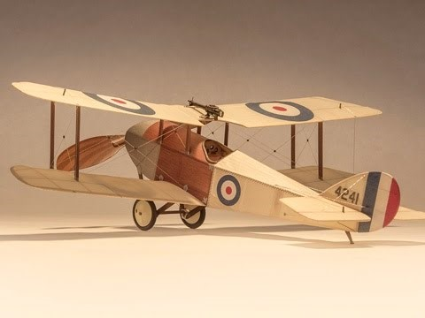

Avro 500 1912 Легкий многоцелевой
самолет 12 самолетов 5 вариантов самолета под
обозначением Avro 502.

---

Авро 504 504A B C J R
1913 Многоцелевой вспомогательный самолет 8970 самолетов всех модификаций

---

Avro 548 учебно-тренировочный самолет 1919 35 самолетов

---

Armstrong Withworth F.K.2 Вспомогательный самолет 1915
7 самолетов

---

Armstrong Withworth F.K.3 LITTLE ACK Вспомогательный самолет 1915 около 500 самолетов

---

Armstrong Withworth F.K.8 BIG ACK Разведывательный самолет 1916 1650 самолетов

---

Airco De Havilland DH6 1917  
Учебно-тренировочный самолет более 2,280 самолетов

---

Bleriot XI 1909 Разведывательный и наблюдательный самолет

---

Bristol Boxkite 1910 Легкий многоцелевой самолет 70 самолетов

---

Bristol - Prier monoplane / P-1 1911 34 самолета

---

Bristol - Military type - 1911 - Великобритания 8 самолетов

---

Bristol Coanda Monoplanes 1912 Легкий многоцелевой самолет
37 самолетов

---

Bristol TB.8 GB.75 1913 Многоцелевой вспомогательный самолет 54 самолета

---

Bristol Baby (Scout) (Scout - "разведчик"). 1914 Легкий вспомогательный самолет Всего построено около 1000 "Скаутов" в четырех модификациях. А", "В", "С" и "D", различавшихся назначением и типами двигателей.

---

Grahame-White TYPE XV Учебно-тренировочный самолет 1913 135 самолетов

---

Mann, Egerton TYPE B Разведчик-бомбардировщик 1916 Разведчик-бомбардировщик 15 самолетов

---

Martinsyde S.1 Разведывательный самолет 1914 60 самолётов

---

Panther Parnall  
1918 корректировщик и разведчик Компания "Parnall" выпустила шесть самолетов В общей сложности 150 пантеры были построены Бристоль Airplane Company , так как после окончания Первая мировая война Parnall прекратил производство самолетов.

---

Pemberton-Billing PB.25 SCOUT Разведывательный самолет 1915 20 самолетов

---

Port Victoria GRAIN GRIFFIN Разведывательный самолет 1917 7 самолетов

---

RAF B.E.2A(B) 1912 Разведывательный самолет 32 B.E.2 15 B.E.2a 85 B.E.2b

---

RAF BE2c 1914 г. Разведывательный самолет 1500 самолетов

---

RAF BE2е 1916г. Разведывательный самолет 1803 самолета

---

RAF Ве8 1913 разведчик 24 самолета

---

RAF В.Е.8а, 1915 легкий бомбардировщик 42 самолета

---

RAF R.E.5 Легкий разведчик-бомбардировщик 1914 24 самолета

---

RAF S.E.4a Разведывательный самолет 1915 4 самолета

---

Short S.38 1912 Учебно-тренировочный самолет 48 самолетов

---

Sopwith GUNBUS Многоцелевой самолет1913 40 самолетов

---

Sopwith TWO-SEATER SCOUT Разведывательный самолет 1914 24 самолета

---

Sopwith Baby 1915 Легкий вспомогательный самолет 386 самолетов.

---

White & Thompson NT.3 Bognor Bloater (франт из Богнора) 1915 Разведывательный самолет
12 самолетов

