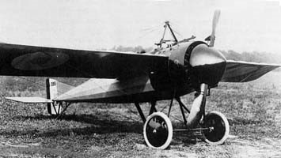
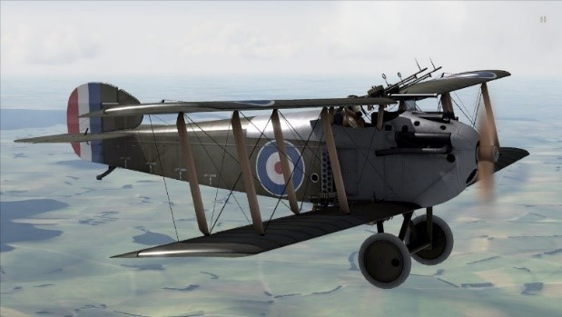
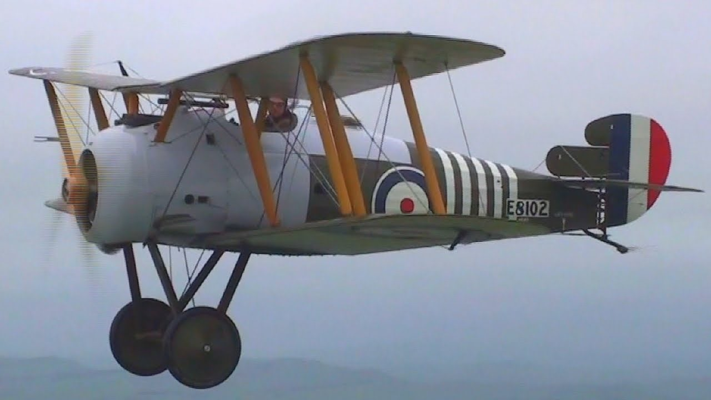

Armstrong Whitworth FK3 1915 Фронтовой самолет (Little Ack). 500 самолетов

---

Armstrong Whitworth FK10 Quad 1916 Истребитель 9 (1 F.K.9 + 8 F.K.10) самолетов

---

Airco DH.1, Аirco DH.1A 1915 Истребитель-разведчик 100 самолетов DН.1 и DH.1А.

---

Airco DH.2 1915 Истребитель-разведчик 453 самолёта

---

Airco DH.5 (De HavillandDH.5) Истребитель-разведчик.1917
550 самолетов

---

ВАТ FK-22 / FK-23 Bantam "Бэнтэм".1918 Истребитель 15 самолетов

---

Beardmore WBIII S.B.3F 1917 Палубный истребитель 100 самолетов

---

Bristol F.2A Fighter 1916 Истребитель 50 самолетов

---

Bristol F.2B Истребитель 1917 3101 самолет

---

Bristol M1C (Bristol Bullet) 1916 Истребитель 130 самолетов

---

Bristol Scout E F 1918 Истребитель 4 самолета

---

Fairey F.2 1916 истребитель несколько десятков самолетов

---

Martinsyde S.1 1914 истребитель 61 самолет

---

Martinsyde F.3 Истребитель 1917 6 самолетов

---

Martinsyde F.4 BUZZARD Истребитель 1918 370 самолетов

---

Martinsyde G.100 ELEPHANT Истребитель-бомбардировщик 1915 более 100 самолетов

---

Morane BULLET Истребитель-разведчик 1914 49 самолетов

---

Nieuport NIGHTHAWK Истребитель 1919 70 самолета (54 из них еще оставались без двигателя)

---

Pemberton-Billing P.B.23 / P.B.25 Push-Prodge 1915 истребитель 20 самолетов

---

RAF AE.3 RAM Штурмовик 1918 3 самолета

---

RAF F.E.2 Многоцелевой истребитель 1915
Производство самолетов моделей F.E.2a/F.E.2b насчитывало 1939 экземпляров. Были также построены два самолета F.E.2c

---

RAF FE.8 1915 Истребитель 300 самолетов

---

RAF BE12 1916 Истребитель легкий фронтовой бомбардировщик 468 самолетов 120 экземпляров варианта В.Е.12b.

---

RAF BE2e 1916 истребитель 1803 самолетов

---

RAF SE5 / SE5a 1916 Истребитель 59 самолетов SE.5, SE.5a 5300 самолетов

---

Sopwith 1,5 Strutter 1915 Многоцелевой истребитель (читается - "Уан халф страттер")как полуторастоечник".4500 самолетов Франция 1439 самолетов Великобритания 100 самолетов Россия

---

Sopwith TWO-SEATER Многоцелевой истребитель 1914 24 самолета

---

Sopwith F1 Camel 1916 Истребитель 5695 самолетов самый массовый английский истребитель Первой мировой войны

---

Sopwith 2F.1 Camel палубный истребитель 1917 морской вариант Camel 275 самолетов

---

Sopwith Pup 1916 Истребитель 1847 самолетов всех вариантов.

---

Sopwith Triplane 1916 Истребитель 147 самолетов.

---

Sopeith 5F.1 Dolphin 1917 Истребитель 2 072 самолета

---

Sopwith Dragon 1918 Истребитель контракт 200 штук построили 76 самолетов

---

Sopwith Salamander T.F.2 1918 штурмовик 497 самолетов

---

Sopwith Snipe / 7F.1 1918 Истребитель 1567 самолетов

---

Vickers FB.5 Gunbus 1914 Истребитель 224 самолетов

---

Vickers FB.9 Gunbus 1915 истребитель 100 самолетов

---

Vickers ES.1 ES.2 1915 истребитель 3 самолета

---

Vickers B.12 1916 истребиль 50 самолетов

---

Vickers F.B.14 А D F Истребитель-разведчик 1916 около 100 самолетов

---

Vickers FB.19 1916 Истребитель 50 самолетов FB.19 Mk.I 24 самолета Mk.II,

---

Vickers FB.26A VAMPIRE II Штурмовик 1918 6 самолетов

---

Westland Wagtail (трясогузка) 1918 Истребитель 5самолетов

