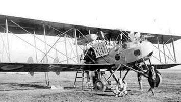
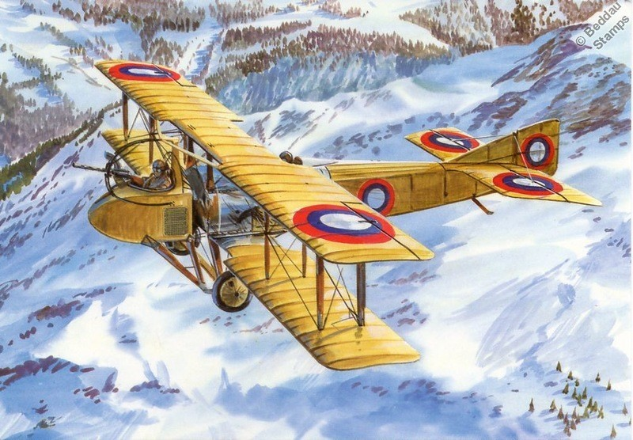

Истребители Франции

Béchereau SAB C. 1  Истребитель   1918   5 самолетов 

Bréguet 5  Самолет непосредственной поддержки   1916  35 самолетов     Из которых 25 было произведено в Великобритании под названием G.W.19

Bréguet 17  Тяжелый истребитель  1918  около 100 самолетов 

Gourdou-Leseurre GL.2   Type B   Истребитель  1918    20 самолетов

Caudron R.11 Ударный самолет сопровождения  1917  20 самолетов

Morane MONOSOQUE Истребитель-разведчик  1914  более 100 самолетов

Morane-Saulnier AC  , Истребитель   1916    32 самолета   

Morane-Saulnier AI   Истребитель   1917    MоS.27 был вооружен пулеметом Vickers калибра 7,7 мм с прерывателем. Вариант с двумя пулеметами Vickers имел обозначение MоS.29   1210 самолетов   

Morane-Saulnier  I Type I  Истребитель   1916    4 самолета  

Morane-Saulnier L   Истребитель-разведчик 1913   600 самолетов

Morane-Saulnier TYPE N\Monocoque\ Bullet  Истребитель-разведчик   1914  499 самолетов

Morane-Saulnier TYPE V Истребитель   1916  около 30 самолетов

Morane-Saulnier TYPE G Истребитель-разведчик  1912   Выпуск типов Н и G составило 94 самолета

Ponnier M.1  Истребитель   1915    20 самолетов   

Salmson 4 Cамолет поддержки войск 1918    16 самолетов

SEA IV С2 Двухместный  Истребитель   1918  115 самолетов 

SPAD SA.1 Истребитель  1915    11 самолетов  

SPAD SA.2 Истребитель  1916 40   самолетов

SPAD SA.4 Истребитель  1916  59 самолетов

SPAD S. VII   Истребитель   1916     Общее количество , источники варьируются от 3825 до примерно 5600 SPAD S. VIIs, построенных во Франции, 220 В Соединенном Королевстве и около 100 в России.

SPAD S. XII  пушечно-вооруженный истребитель   1917     заказ на 300 самолетов  

SPAD S.ХIII Истребитель   1917    8472 самолета, 

SPAD S. XIV   гидросамолет-истребитель     1917   40   самолетов

SPAD S.ХVI Истребитель-разведчик  1917  около 1000 самолетов

SPAD S.ХVII Истребитель-разведчик 1917 20 самолетов

SPAD S.ХХ Истребитель  1918   100 самолетов

Hanriot HD.1  одноместный  истребитель  1916    1145  самолетов

Hanriot HD.2   Истребитель-гидросамолет  1918   10 самолетов

Hanriot HD.3 C. 2  двухместный истребитель   1917  90 самолетов

Nieuport N.10 Истребитель   1915  свыше 600 самолетов

Nieuport N.12 Истребитель-разведчик 1915  300  самолетов

 Nieuport 11    Bebe    Истребитель   1915  более 2000 самолетов   

Newport  N.17 Истребитель   1916    2000 самолетов

Nieuport  24\24 бис\27 Истребитель   1917  свыше 1100 самолетов     

Nieuport  28  Истребитель   1917  свыше 300 самолетов      

Voisin LB (LBP, LBR) Самолет непосредственной поддержки войск  1916  23самолета  LBP   около 60 самолетов  LBR

