Летающие лодки     великобритании
 
AD FLYING-BOAT Многоцелевая летающая лодка  1916  29 самолетов
 
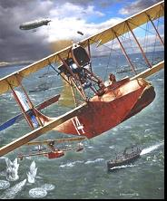

Avro  503  Многоцелевой гидросамолет  1913  5 самолетов
 
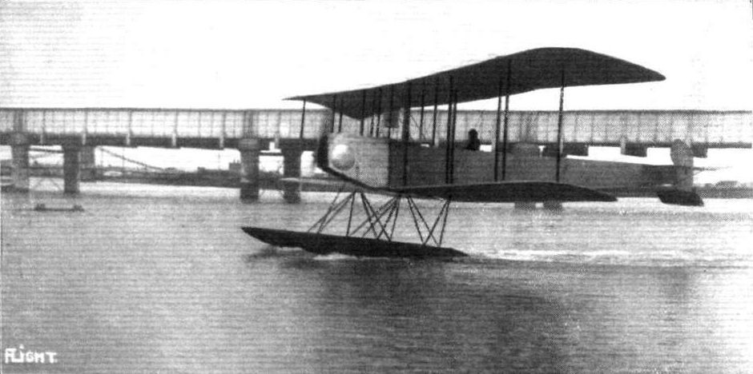

Avro 504L Многоцелевой гидросамолет   1919   6 самолетов

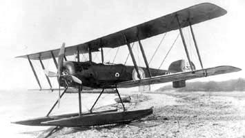

Avro 510 Вспомогательный гидросамолет   1914   6 самолетов

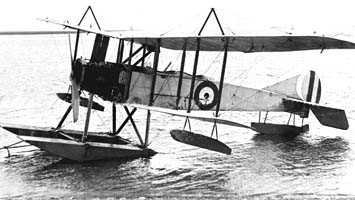

Fairey IIIВ Гидросамолет-разведчик   1917 25 самолетов

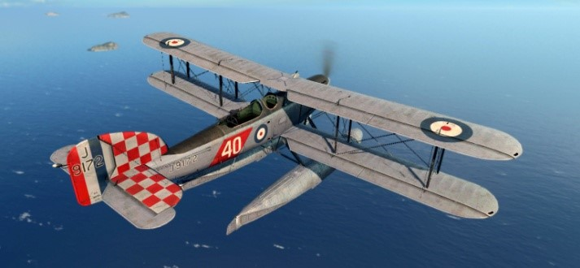

Fairey CAMPANIA Гидросамолет-разведчик  1917   62 самолета
 
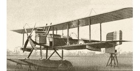

Fairey HAMBLE BABY Разведывательный гидросамолет   1917   180 самолетов

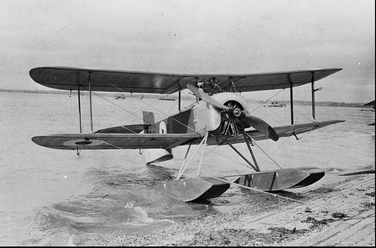

Felixstowe F.1  Многоцелевая летающая лодка  1916  4 самолета 

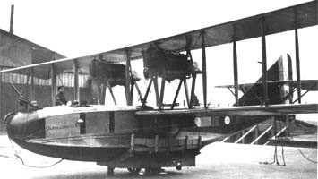

Felixstowe F.2 Многоцелевая летающая лодка  1917      175 самолетов

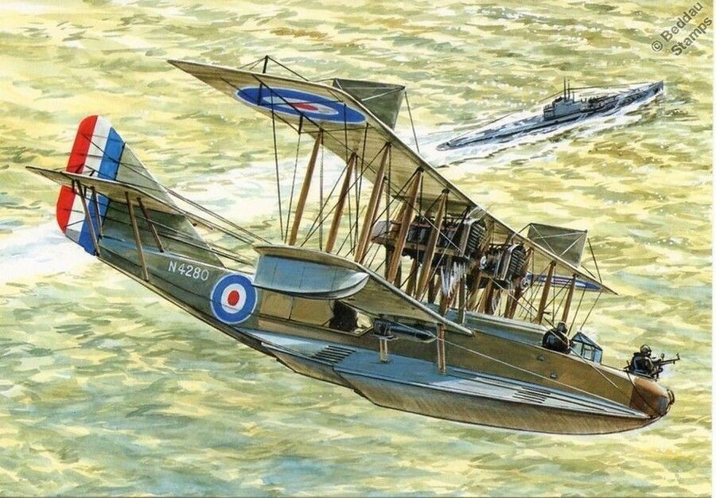

Felixstowe F.3 Многоцелевая летающая лодка  1917  182 самолета
 
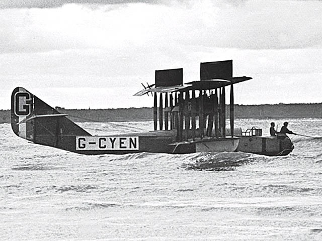

Felixstowe  F. 5 ; летающая лодка  1918   163 самолетов

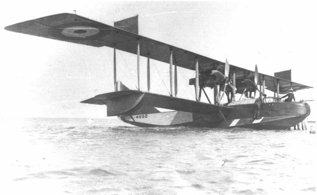

Felixstowe F5L  летающая лодка   227    самолетов  F5L был построен военно-морским авиационным заводом США (137), Curtiss (60) и Canadian Aeroplanes Limited (30)

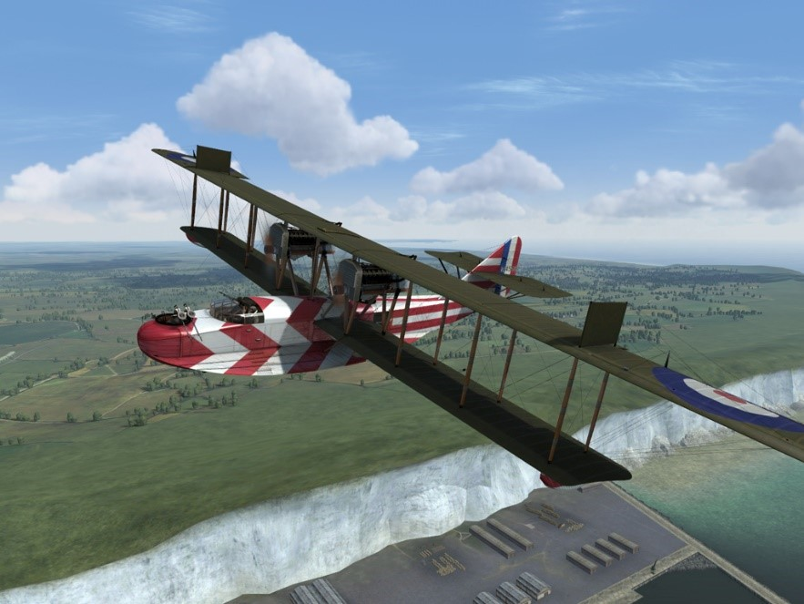

Felixstowe PORTE BABY Многоцелевая летающая лодка  1916  11 самолетов 

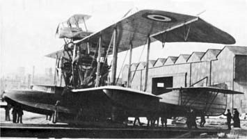

Norman Thomson NT.2B Учебно-тренировочная летающая лодка  1917    более 200 самолетов
 
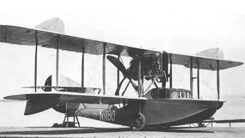

Norman Thomson NT.4 Патрульная летающая лодка   1915  26 (N.T.4), 44 (N.T.4A), 2 (N2C)

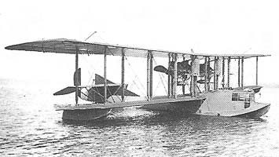

Phoenix P.5 CORK Многоцелевая летающая лодка  1918  2 самолета 

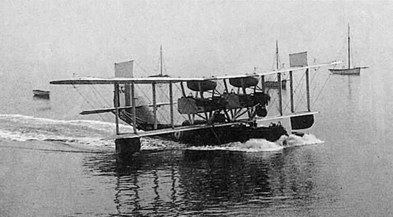

RAF C.E.1 Патрульная летающая лодка  1918    2 самолета 

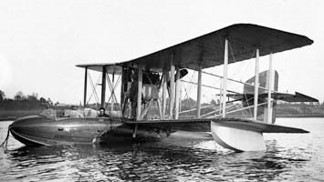

Sopwith BAT BOAT Многоцелевая летающая лодка  1913  6 самолетов
 
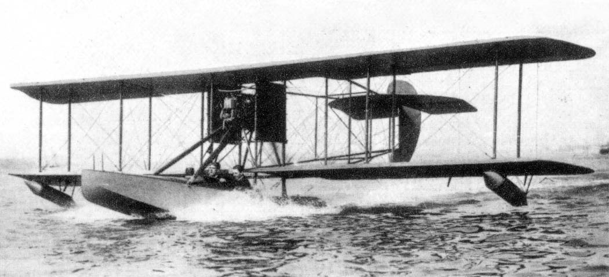

Sopwith ADMIRALTY TYPE 807 Разведывательный самолет  1914   12  самолетов 

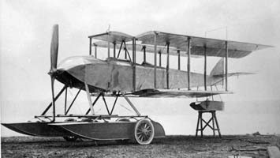

Sopwith BABY Легкий вспомогательный самолет  1915  386 самолетов

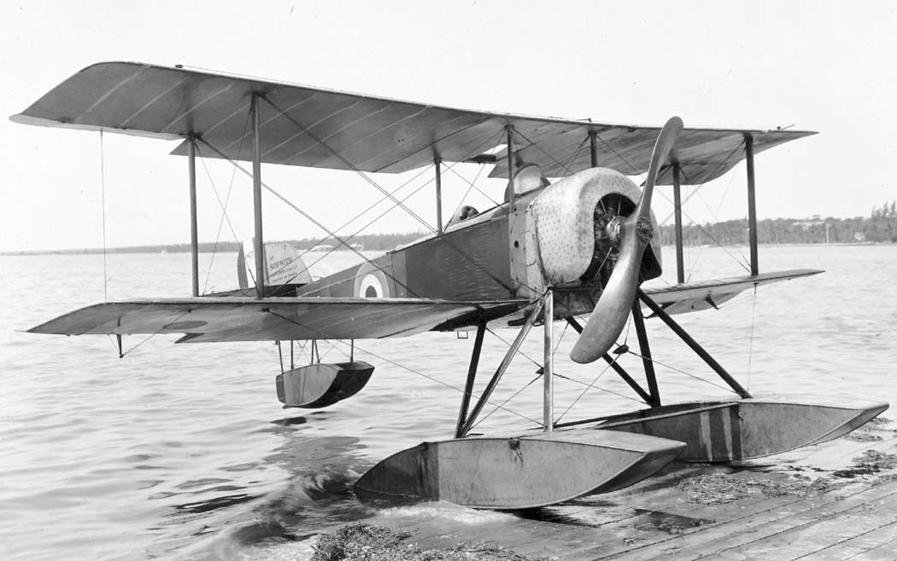

Sopwith HT (HYDRO TRACTOR) Вспомогательный самолет 1913  3 самолета

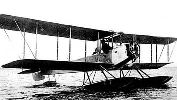

Sopwith Schneider        1914  Поплавковый истребитель-разведчик   144  самолетов 
 
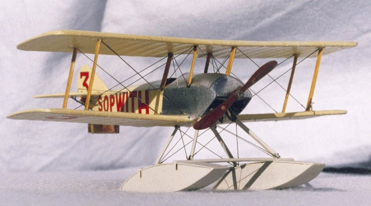

Short FOLDER Многоцелевой вспомогательный гидросамолет  1913  6 самолетов 

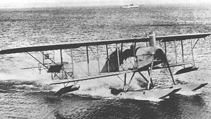

Short S.41 Вспомогательный  гидросамолет             1912   3 самолета  

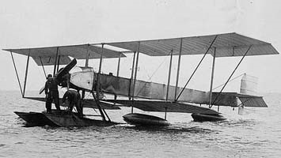

Short S.45 Учебно-тренировочный самолет  1912    4 самолета

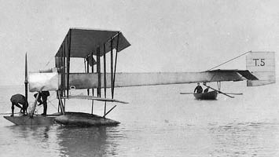

Short S.74 Разведывательный гидросамолет  1914      18 самолетов
 
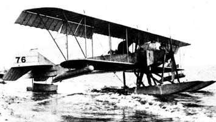

Short Type 135        1914  Разведывательный гидросамолет  
2 самолета.тип 135

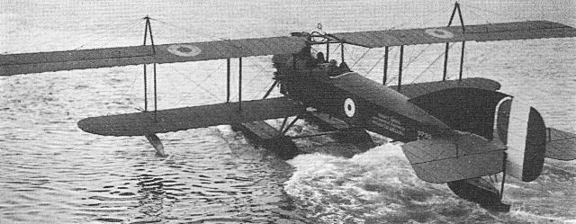

Short S.166 Разведывательный гидросамолет  1914  26 самолетов

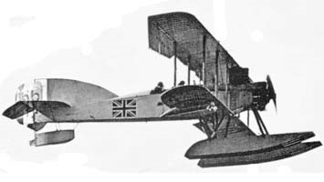

Short S.184 Многоцелевой разведчик 1915 1096 машин.

Short Type 827   Type 830 - Великобритания - 1914 разведывательный бомбардировщик гидросамолет108 самолетов (Тип 827) 18 самолетов (Тип 830) 
 
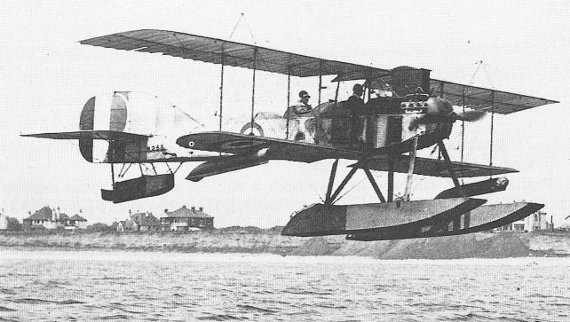

Wight NAVYPLANE Вспомогательный гидросамолет  1914    11 самолетов в различных вариантах 

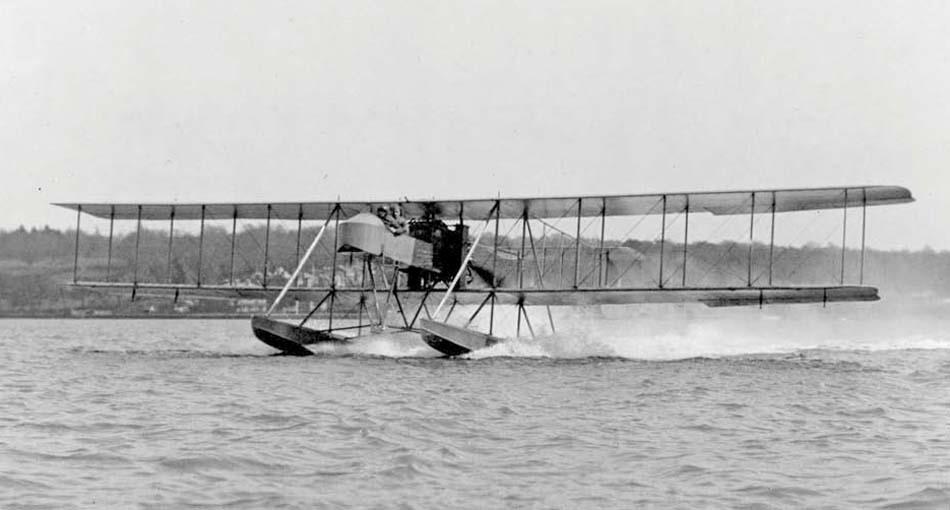

White & Thompson NT.2  1915  Летающая лодка  25  самолетов

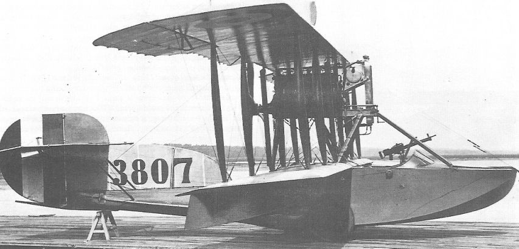

Wight No.2 Navyplane 1914  Вспомогательный гидросамолет   6 самолетов   

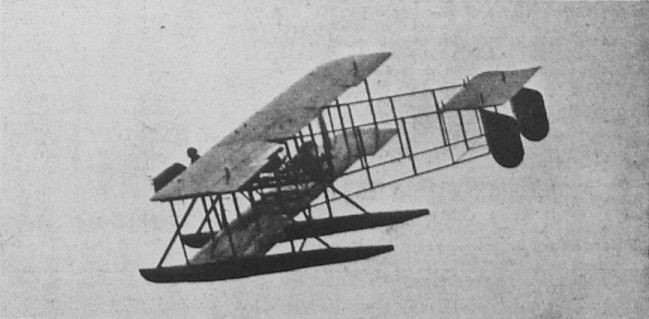

Wight 840 Бомбардировщик-торпедоносец   1915  52 самолета
 
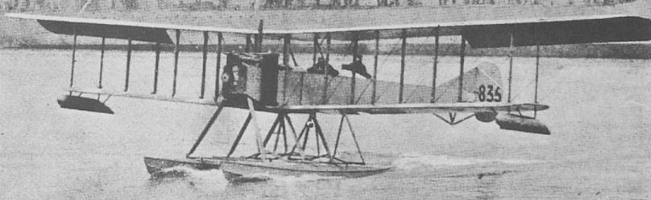

Wight CONVERTED SEAPLANE Легкий бомбардировщик   1917   37 самолетов

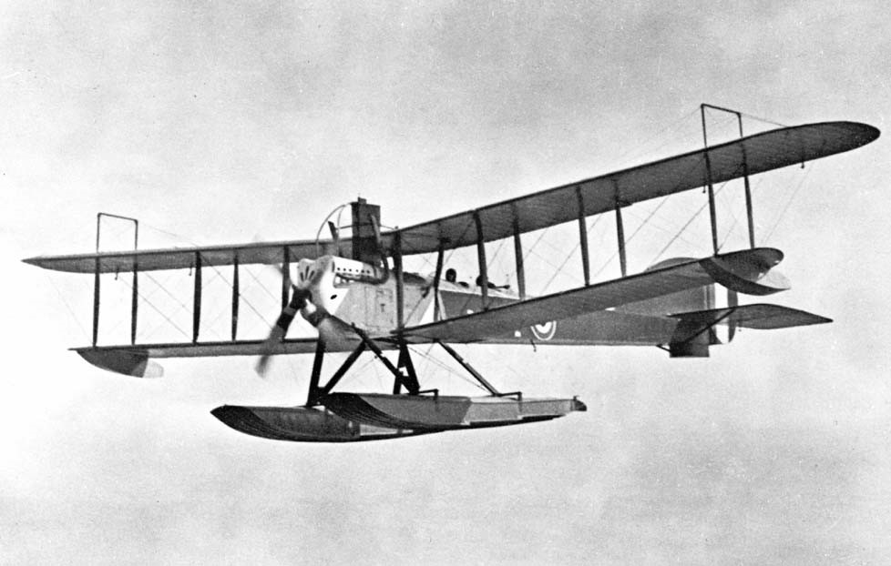

Wight Twin Landplane 1915 Торпедоносец 3 самолета 

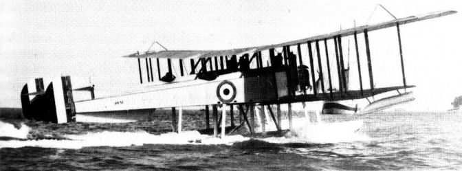