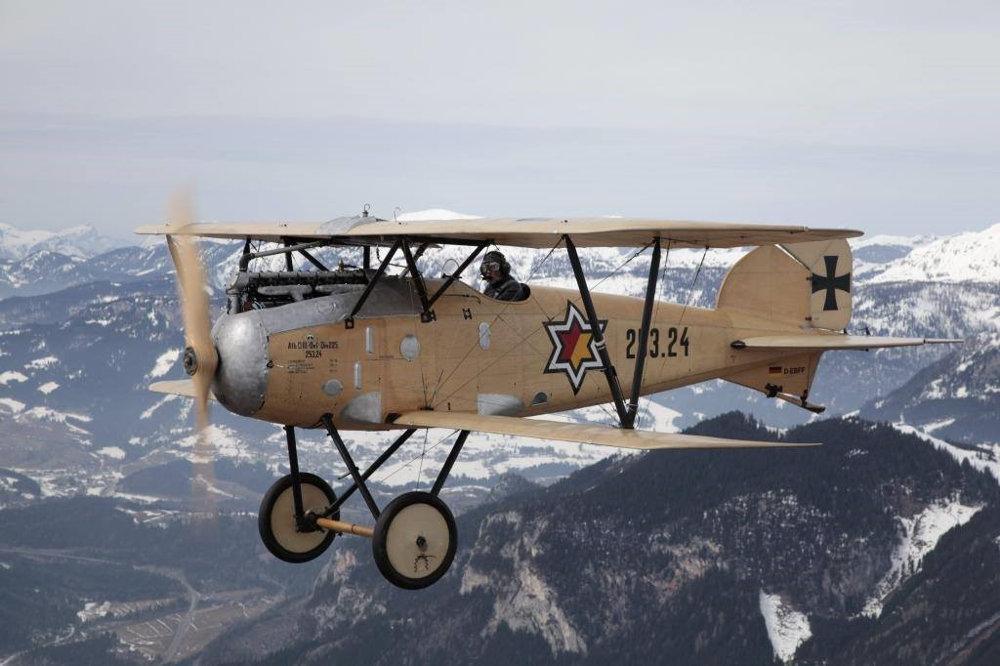
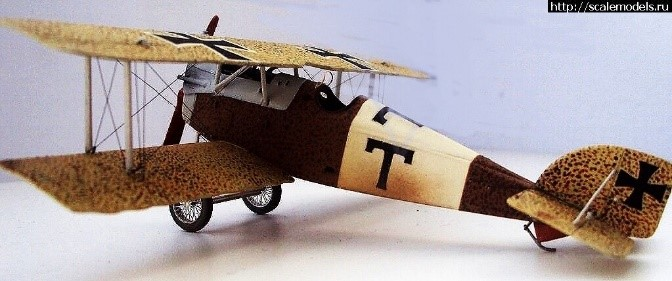
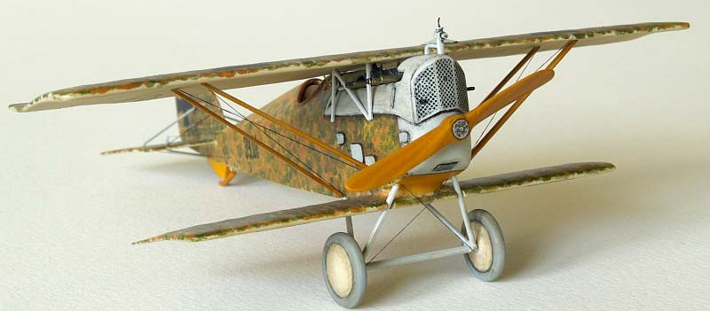
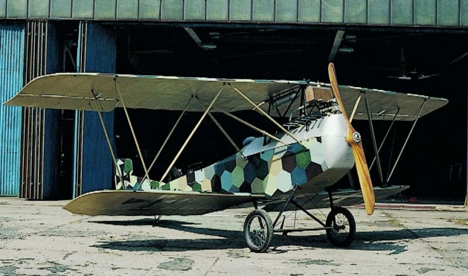
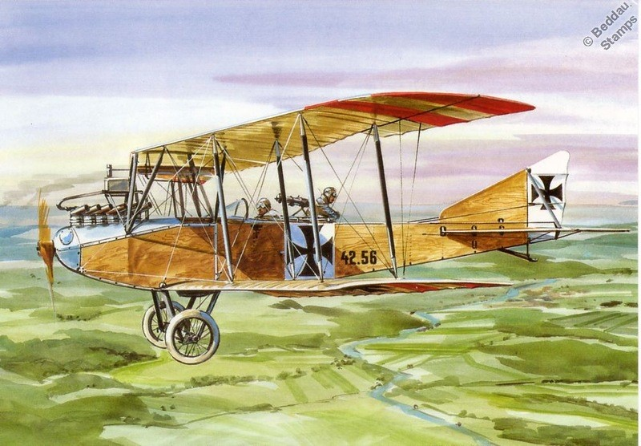
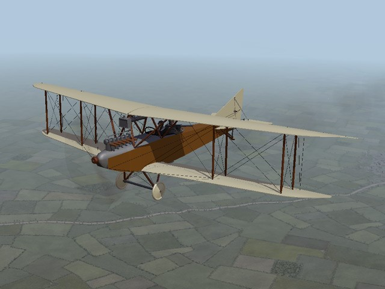
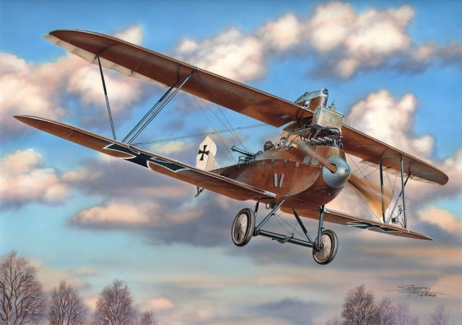
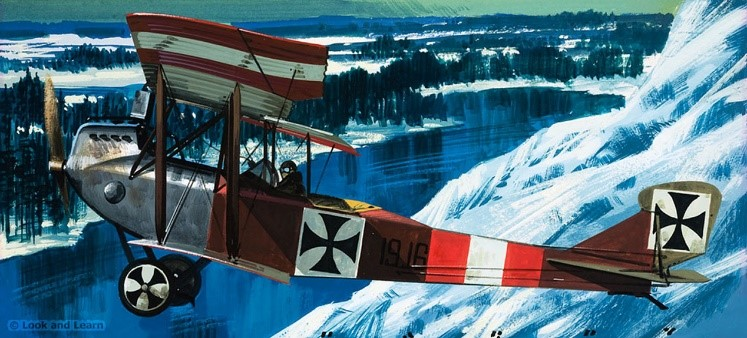

 # Заголовок
 Самолеты Австро-Венгрии выпускавшиеся серийно.

Albatros(Oeffag) D.III  1917 Истребитель   280 самолетов под индексом "серия 153"  До выхода Австро-Венгрии из войны успели построить 201 самолет. серии 253

_B_I_B_II.png "Aviatik_(Berg)_B_I_B_II")

Aviatik (Berg) B.I / B.II
1914 Самолет-разведчик 	около 360 самолетов типов Р. 13, Р. 14 и Р. 15.

_C.I.jpg "Aviatik_(Berg)_C.I")

Aviatik (Berg) C.I 1917  Фронтовой самолет  более 500 самолетов

Aviatik D.I   1917  Истребитель   740 самолетов

Aviatik Berg D.II  1917  Истребитель  19 самолетов

Knoller C.II —1917 истребитель-разведчик. около 200 самолетов.

Lloyd C. I  1913
разведывательный самолет  13 самолетов

Lloyd C-II / C-III, IV   1915 г.   Самолет-разведчик
100 самолетов × C.II
50  самолетов × С. III 
40 самолетов  × С. IV

Lloyd C –V  1917 Вспомогательный самолет
C. V s построенный Lloyd с двигателем Austro-Daimler 96 самолетов
C. V s построенный WKF с двигателем Benz 48 самолетов

<!-- Lohner B-I/B-II/B-IV/B-VI/B-VII/C-I 1912 Фронтовой самолет -->
<!-- •	B.II -   96 самолетов -->
•	B.III -   30 самолетов 
•	B.IV -   9 самолетов 8 из них Ufag
•	B.V -   6 самолетов 
•	B.VI -   18 самолетов

Lohner E/L/M/R/T 1915 Разведывательная летающая лодка 123 самолета различных вариантов

Oeffag G 6 1916   разведывательным летающим катером 12 самолетов в том числе 2 не завершено

Phonix D-I/D-II/D-III  1917 Истребитель  Всего было произведено  160 самолетов - D1, 144 самолета - DII,  48 самолетов - D IIа . 29 самолетов - DIII.

Phonix/UFAG C-I  1918 Истребитель
250 самолетов

Ганза-Бранденбург D I  1916  Истребитель     123 самолета

Ганза-Бранденбург G. I  1915
средний бомбардировщик  12 самолетов

Ганза-Бранденбург СС (KDW)  1916г. 
Истребитель-летающая лодка   73 самолета

