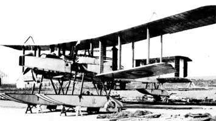

Avro 504C Легкий бомбардировщик 1914 80 самолетов

---

Avro 504 E Легкий бомбардировщик 1914 10 самолетов

---

Avro 519 Легкий бомбардировщик Великобритания 1916 4 самолета

---

Avro Pike Type 523 1916 Дальний бомбардировщик 2 самолета

---

Avro 529 Дальний бомбардировщик 1917 2 самолета

---

Avro 533 MANCHESTER Дальний бомбардировщик 1918 3 самолета

---

A.D. Navy Pusher Seaplane 1916 разведывательно
-бомбардировочный 2 самолета

---

Boulton-Paul BOURGES P.7 Средний бомбардировщик 1919 3 самолета

---

Blackburn BLACKBURD Бомбардировщик-торпедоносец 1918 3 самолета

---

Blackburn GP Бомбардировщик-торпедоносец 1916 3 самолета

---

Blackburn KANGAROO RT1 Тяжелый бомбардировщик 1917 20 самолетов

---

Blackburn T.B. Бомбардировщик-истребитель дирижаблей 1916 9 самолетов

---

Bristol BRAEMAR Тяжелый бомбардировщик 1918 2 самолета

---

Bristol Braemar Pullman 1918 тяжелый бомбардировщик 3 самолета

---

Dyott BOMBER Бомбардировщик 1916 2 самолета

---

De Havilland D.H.3 1915 легкий бомбардировщик 2 самолета

---

De Havilland D.H.4 1916 Дневной бомбардировщик Англии-выпустили 1449 и 2500 в США 3949 самолетов

---

De Havilland ДН9 1917 Дневной бомбардировщик 3204 самолёта

---

De Havilland ДН9А 1918 Дневной бомбардировщик построено около 885 самолетов

---

De Havilland DH10 1917 Фронтовой бомбардировщик 236 самолетов

---

Havilland D.H.11 Oxford Средний бомбардировщик 1919 2 самолета

---

Handley Page Н.Р.11 O 100 Тяжелый бомбардировщик 1915 46 самолетов

---

Handley Page Н.Р.12 O 400 Тяжелый бомбардировщик 1918 554 самолета

---

Handley Page Н.Р.15 (V 1500) Дальний тяжелый бомбардировщик 1918 заказ 32 самолета

---

Short N.2B - 1917 патрульный бомбардировщи 2 самолета

---

Short Type 74 Folder 1913 торпедоносцы 7 самолетов

---

Short Type 81 Folder 1913 торпедоносцы 9 самолетов

---

Short BOMBER Type 224 Тяжелый бомбардировщик 1915 83 самолета

---

Short Type 184 / Type 225 1915 Многоцелевой разведчик-торпедоносец 1096 самолетов

---

Short Type 310 1916 разведчик торпедоносец гидросамолет 2 самолета

---

Short Type 320 1916
Бомбардировщик-торпедоносец 127 самолетов

---

Short SHIRL Бомбардировщик-торпедоносец 1918 3 самолета

---

Short Type 827 - 1914 разведывательный бомбардировщик гидросамолет 108 самолетов

---

Short Type 830 - 1914 разведывательный бомбардировщик гидросамолет 18 самолетов

---

Sopwith B.1 Легкий бомбардировщик 1917 7 самолетов

---

Sopwith COBHAM Средний бомбардировщик 1919 3 самолета

---

Sopwith T.1 CUCKOO Бомбардировщик-торпедоносец 1917 90 самолетов

---

Sopwith TABLOID Бомбардировщик-разведчик 1913 36 самолетов

---

Sopwith TYPE 860 Торпедоносец 1914 22 самолета

---

Sopwith Rhino 2B.2 1917 Легкий бомбардировщик
2 самолета

---

Martinsyde G.100 ELEPHANT Легкий бомбардировщик 1916 100 самолетов

---

Mann & Egerton B 1916 Разведчик-бомбардировщик 15 самолетов

---

Martinsyde G.102 Легкий бомбардировщик 1917 170 самолетов

---

RAF ВЕ2 BE2a 1912г. разведчик и бомбардировщик 32 самолета B.E.2,15 B.E.2a

---

RAF BE2b 1912г. разведчик и бомбардировщик 85 самолетов

---

RAF RE5 1914 Легкий разведчик-бомбардировщик 25 самолетов

---

RAF R.E.7 Легкий бомбардировщик-разведчик 1915 252 самолета

---

RAF RE8 1916 разведчик-бомбардировщик
4077 самолетов

---

Vickers FB.27 VIMY (Энергичный) Тяжелый бомбардировщик 1917 4 самолета

---
