Бомбардировщзики  Франции

Bernard AB 1 Средний ночной бомбардировщик 1918-9     12 самолетов

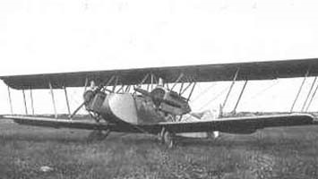

Borel-Odier BO.2 (BO-T)  Бомбардировщик-торпедоносец   1916      92 самолета

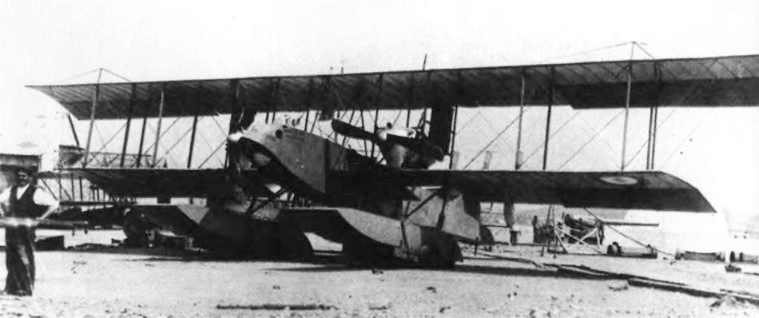

Bréguet 4 (BU3) Бомбардировщик 1914   около 100 самолетов 

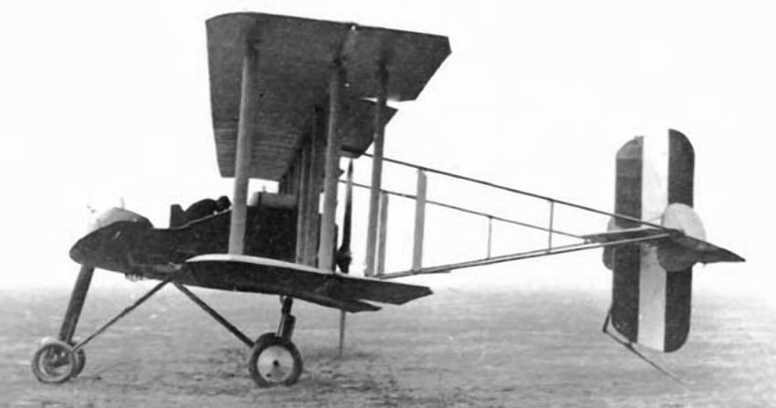

Bréguet 14   бомбардировщик  1917    ~7 800   самолетов 

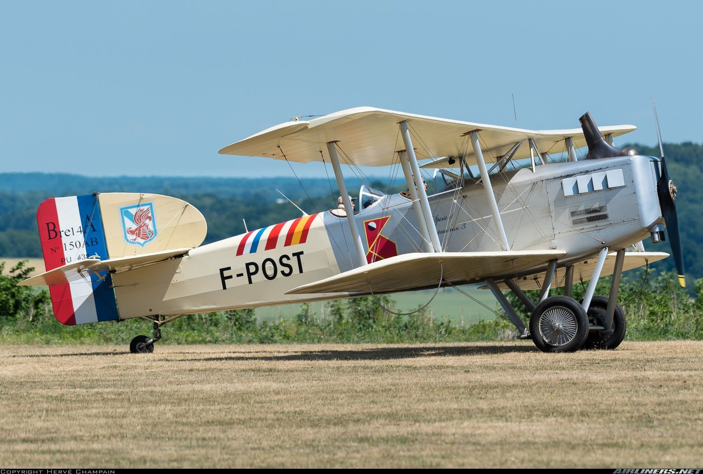

Breguet Br.16 Ночной бомбардировщик  1918    200 самолетов

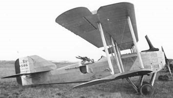

Caudron C.23  Ночной бомбардировщик
1918     54  самолета 

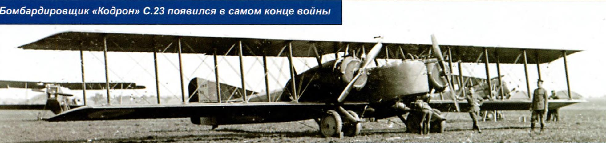

Caudron G.IV Бомбардировщик-разведчик  1915    1358 самолетов

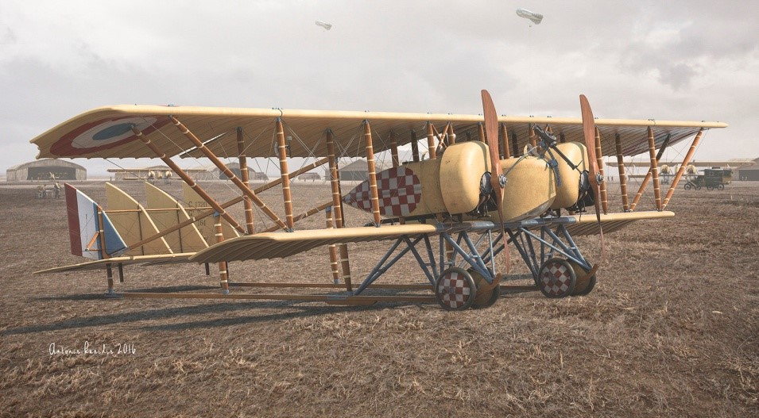

Caudron G.V Бомбардировщик-разведчик  1915   5 самолетов

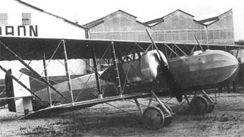

Caudron G.VI Легкий бомбардировщик  1916     512 самолетов  

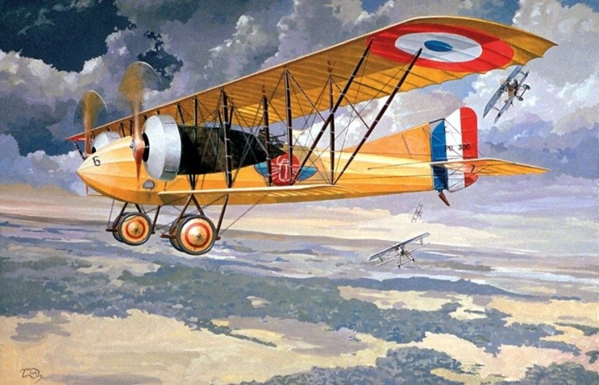

Caudron R.4 (officially Caudron 40 A.3)  1915  Легкий бомбардировщик-разведчик   249  самолета

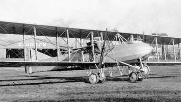

Farman F.50 Тяжелый бомбардировщик  1918  62 самолета

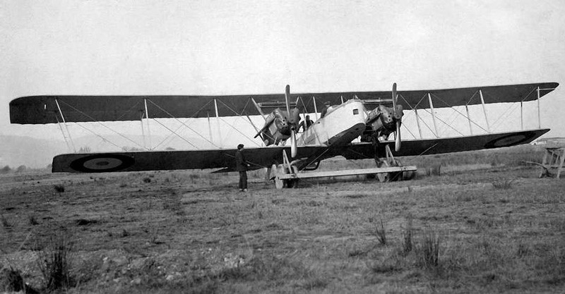

Maurice Farman MF.11 Shorthorn (короткорогий)  1914 разведчик, лёгкий бомбардировщик и учебный самолёт, 

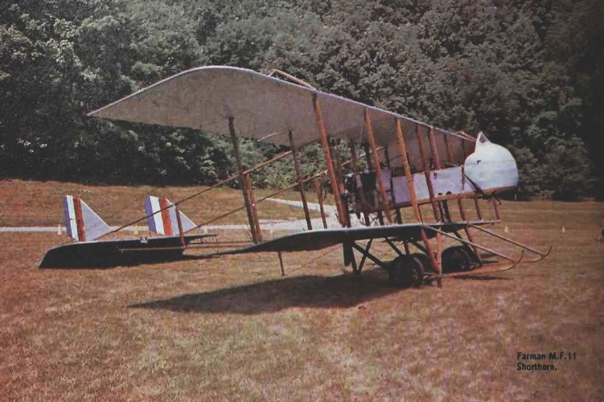

Letord LETORD 1(4) Дальний бомбардировщик  1917 от 250 до 300  самолетов в четырех модификациях

")

Morane-Saulnier TYPE  T Тяжелый бомбардировщик  1916  заказ на постройку 90 серийных экземпляров

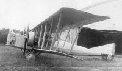

Nieuport 15  1916  Легкий бомбардировщик   4 самолета

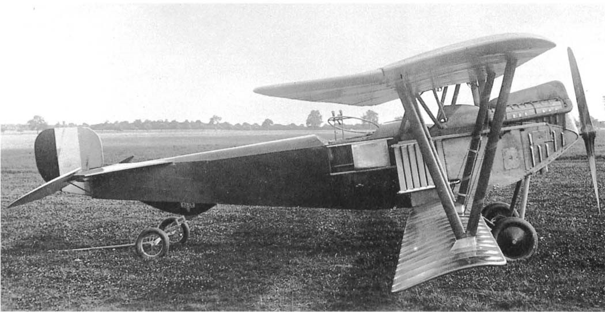

Paul Schmitt P.S.3  1914  Легкий бомбардировщик   6 самолетов 

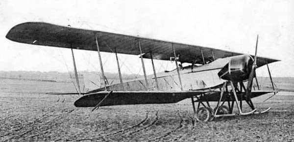

Paul Schmitt P.S.7  Sch 7.В2  1915    Легкий бомбардировщик       150-200 самолетов 

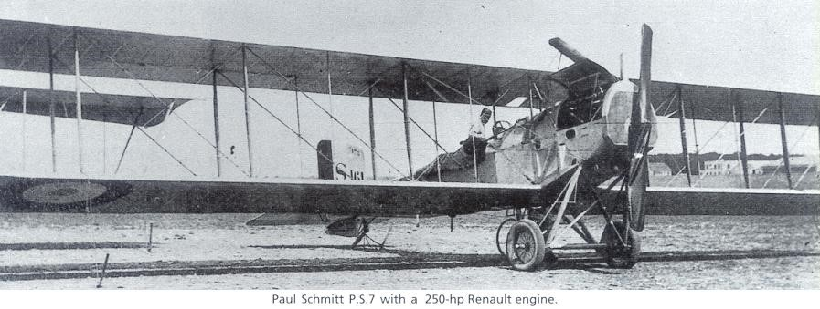

Salmson SAL.1A3. SM.1  Легкий бомбардировщик-разведчик  1916  32 самолета

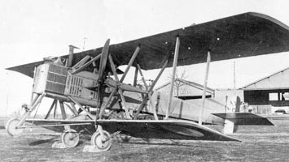

Schmitt PS.7 Sch 7.В2 \  PS.7В2 Легкий бомбардировщик   1915   150  самолетов эропланов обеих модификаций

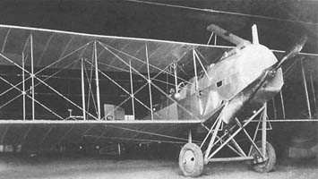

Voisin III  1914  Легкий бомбардировщик  
 Voisin LA: двухместный бомбардировщик-биплан
Voisin LAS: улучшенная версия с поднятой установкой двигателя     1350   самолетов 

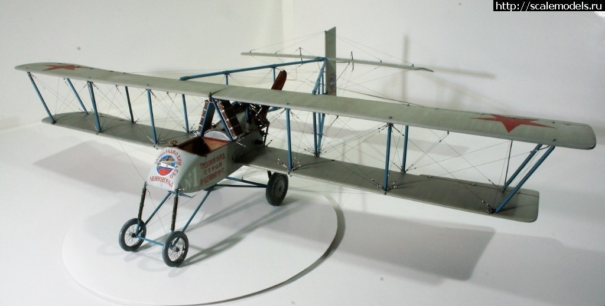

Voisin IV  1915 Легкий бомбардировщик
  Voisin LB: двухместный бомбардировщик, штурмовик-биплан.
Voisin LBS: улучшенная версия.
  200  самолетов 

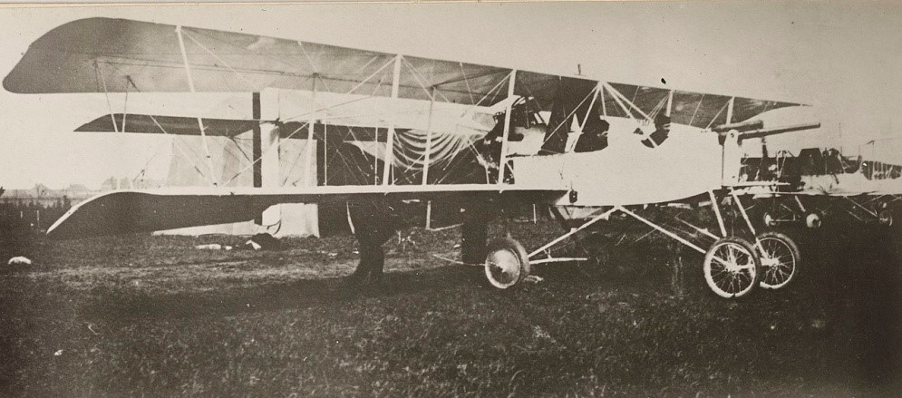

Voisin V 1915 Легкий бомбардировщик   350 самолетов 

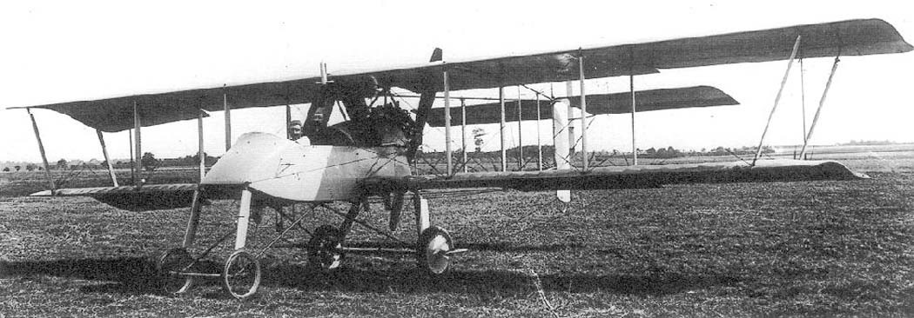

Voisin VI   1916   Тяжелый Бомбардировщик   50 самолетов 

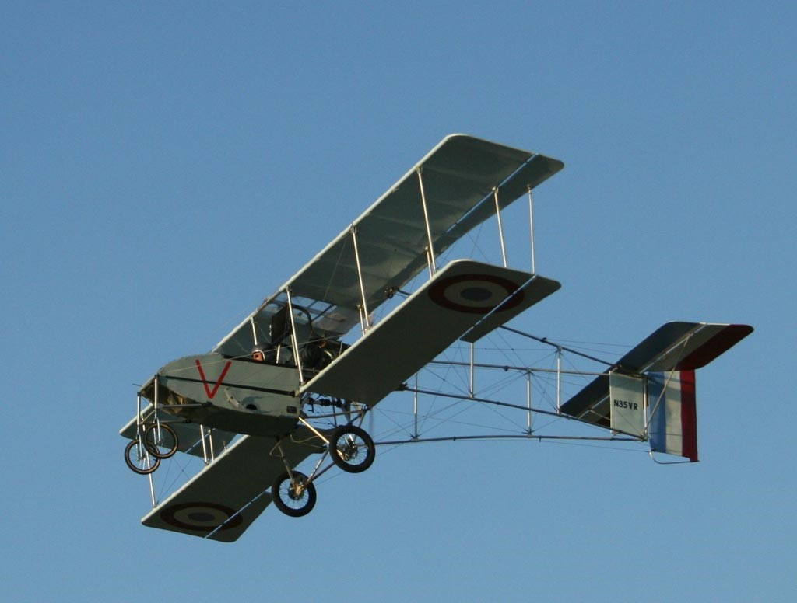

Voisin VIII "Voisin LAP" Легкий бомбардировщик  1915 около 1100 самолетов  Небольшое количество "LAP" и "LAR" было оснащено 47-мм пушкой "Гочкисс" (Voisin LBP и LBR), 

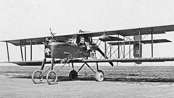

"Voisin LAR" (Voisin X). Voisin X/10/LAR/LBR/E.54  1917  Ночной Бомбардировщик   около 900  самолетов LAR & LBR. 

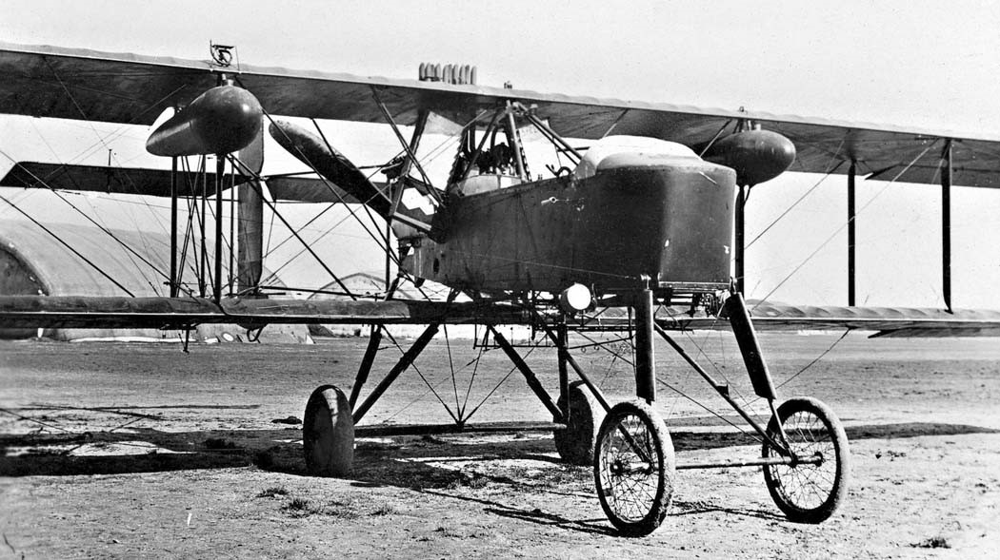