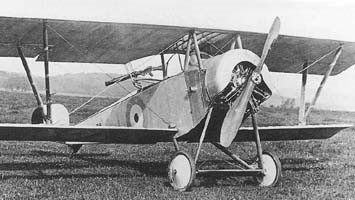
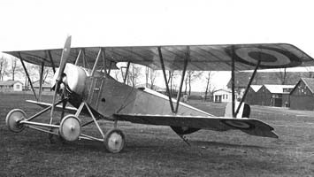

Bleriot XI Разведывательный и наблюдательный самолет 1909 Около 100 самолетов

---

Breguet 4 (BUC) Разведывательный и наблюдательный самолет 1914

---

Bréguet 14 1917 бомбардировщик –биплан и разведывательный самолетом св. 8000 самолетов

---

Breguet 5 Самолет непосредственной поддержки войск 1916

---

Caudron G.II Самолет-разведчик 1914 10 самолетов.

---

Caudron G.III Самолет-разведчик 1914
2849 самолетов

---

Caudron R.4 1915 Разведка
249 самолетов

---

Caudron R. 6 Это была уменьшенная версия Caudron R.4 750 самолетов

---

Deperdussin B/C 1911 Разведчик, Вспомогательный самолет

---

Deperdussin TT Разведывательный самолет 1913 около 170 самолетов

---

Dorand AR.1 Разведывательный самолет 1916 22 самолетов

---

Dorand AR.2 1916 Разведывательный самолет 120 самолетов

---

Dorand DO.1 Разведывательный самолет 1914 около 10 самолетов

---

Farman IV Вспомогательный самолет 1909 в тысячах экземпляров во многих странах

---

Farman HF.16 1912 Разведчик Только в России построено около 300 самолетов

---

Farman МF.7 "Longhorn" - "длиннорог" Разведывательный Учебно-тренировочный
1913 более 350 самолетов

---

Farman МF.11 "Shorthorn" (короткорог). разведчик, лёгкий бомбардировщик, учебный самолёт 1914

---

Farman H.F.23 Разведывательный самолет 1913 около 10 самолетов

---

Farman M.F.12 Разведывательный самолет 1914 несколько самолетов

---

Farman F.15/16 Разведывательный и наблюдательный самолет 1912 несколько сот самолетов

---

Farman F.20/22 Разведывательный и наблюдательный самолет 1914 Всего в России построено до 200 F.20 и F.21.

---

Farman F.27 Разведывательный и наблюдательный самолет 1915 150 самолетов

---

Henry Farman HF.30 Разведывательный и наблюдательный самолет 1915 более 400 самолетов

---

Farman F.40 Разведывательный и наблюдательный самолет 1915 несколько сот самолетов

---

Farman F.46 Учебно-тренировочный самолет 1918 более 10 самолетов

---

Morane-Saulnier MS.30 Учебно-тренировочный самолет 1918 более 50 самолетов Авиационная служба армии США заказала во Франции 51 самолет MoS.30.
В 1922 году французский летчик Фонваль (Fonval) на MS.30E1 выполнил 1111 "мертвых петель"

---

Morane-Saulnier T (or Morane-Saulnier MoS.25 A.3) для стратегической разведки, 1916 заказ на постройку 90 серийных экземпляров

---

Morane-Saulnier MS.35 Type AR Учебно-тренировочный самолет 1915 более 400 самолетов

---

Morane-Saulnier TYPE BB Самолет-разведчик 1915 94 самолета

---

Morane-Saulnier TYPE P Самолет-разведчик MS.21, MS.24 and MS.26) разведчик 1916 595 самолетов

---

Morane-Saulnier G 1912 Истребитель-разведчик
"Мораны" типа G и Н обозначались у нас, как типы "Ж16М" и "Ж14М" А общее количество Н и G составило 94 машины. Тип G был двухместным

---

Morane-Saulnier H 1913 Истребитель-разведчик Тип Н имел такой же фюзеляж типа G, но был одноместным. МОП.1 официальное обозначение для типа H в Германии Pfalz Flugzeugwerke

---

Nieuport IV Самолет-разведчик 1911 около 523 самолетов

---

Nieuport VI Легкий многоцелевой самолет 1911  
колесный Nieuport VIM. Около 100 самолетов

---

Nieuport 12 1915 Разведка (Артиллерия) / Истребитель / Тренажер Более 300 самолетов

---

Nieuport N.13 Учебно-тренировочный самолет 1916 около 10 самолетов

---

Nieuport N.14 Самолет-разведчик 1916 200-300 самолетов

---

Nieuport 20 Истребитель-разведчик 1916 21 самолет в Королевский лётный корпус ( RFC)

---

Nieuport N.80 Вспомогательный самолет 1916 147 самолетов

---

Nieuport N.81 Вспомогательный самолет 1917 173 самолетов

---

Nieuport N.82 Учебно-тренировочный самолет 1916 Около 100 самолетов

---

Nieuport N.83 Вспомогательный самолет 1917 244 самолетов

---

REP PARASOL Разведывательный самолет 1914 12 самолетов
текст

---

REP TYPE N Разведывательный самолет 1912 более 10 самолетов

---

Salmson-Moineau S. M. 1 A3 1916 3-местный разведывательный самолет 155 самолетов

---

Salmson SAL.2 Разведывательный и наблюдательный самолет 1917 3200 самолетов

---

Salmson 4 AB.2, или SAL-4 AB.2 Разведка штурмовик бомбардировщик 1918 12 самолетов

---

Salmson SAL.7 Разведывательный и наблюдательный самолет 1918 20 самолетов

---

SEA IV двухместный французский истребитель и разведывательный самолёт 1918 115 самолетов
SEA IVA2 — самолёт-разведчик
SEA IVC2 — истребитель

---

SPAD DEPERDUSSIN TT Разведывательный самолет 1913 около 100 самолетов

---

SPAD S. XI Разведчик 1917 1000 самолетов

---

SPAD XVI истребитель-разведчик 1917 SPAD 16 был развитием SPAD 11 около 1000 самолетов

---

Voisin VII LC Разведывательный самолет 1916 около 100 самолетов

