Borel HYDRAVION Вспомогательный гидросамолет 1911 25 самолетов

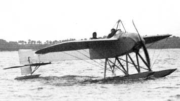

---

Caudron J Разведывательный гидросамолет 1912 3 самолета

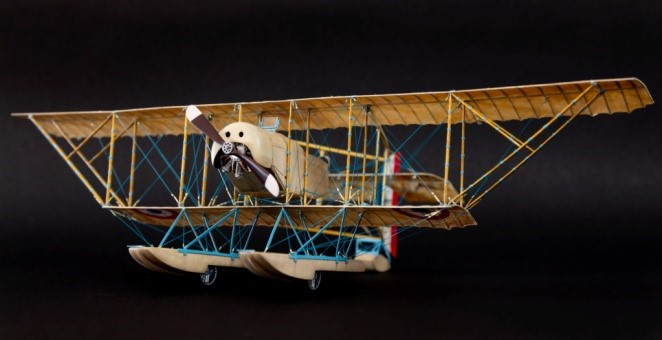

---

Caudron L Разведывательный гидросамолет 1913 3 самолета

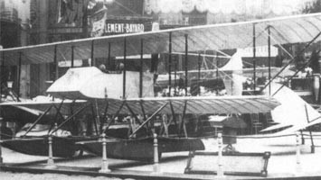

---

Caudron H Вспомогательный самолет 1912 4 самолета

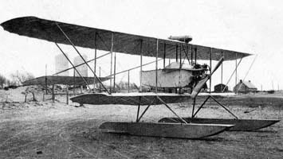

---

Donnet-Denhaut DD.2 Разведывательная летающая лодка 1916 365 самолетов

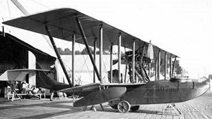

---

Donnet-Denhaut DD.8 Разведывательная летающая лодка 1917 около 500 самолетов

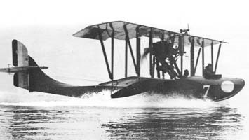

---

Donnet-Denhaut DD. 9 Разведывательная летающая лодка 1918 около 100 самолетов

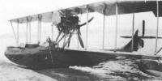

---

FBA A/B/C Разведывательная летающая лодка 1914 несколько сотен лодок FBA в различных вариантах.

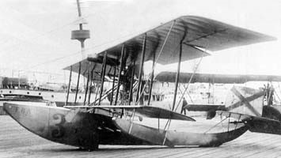

---

FBA H Разведывательная летающая лодка 1917 около 2000 лодок

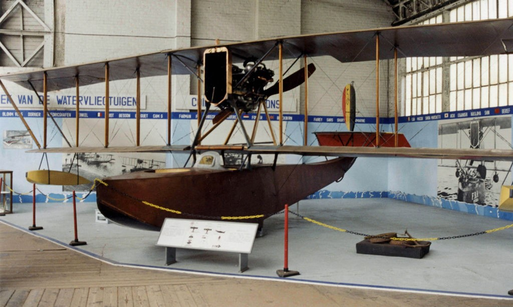

---

FBA S Разведывательная летающая лодка 1918 около 250 лодок

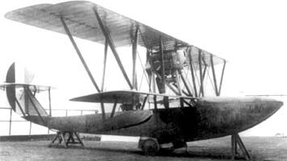

---

Georges Levy G. L. 40 HB2 1918 Разведывательная летающая лодка более 100 лодок

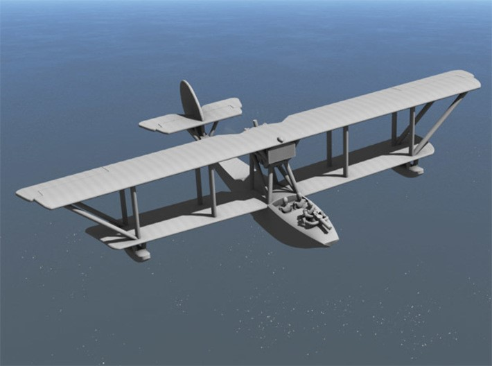

---

Levy-Besson ALERTE Патрульная летающая лодка 1917 250 лодок

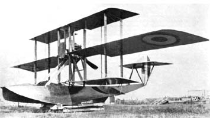

---

Tellier TELLIER 200 Tellier T.2 Многоцелевая летающая лодка 1916 174 лодок

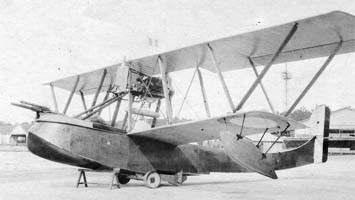

---

Tellier T.3 Многоцелевая летающая лодка 1917 заказ 300 изготовлено 174 лодки

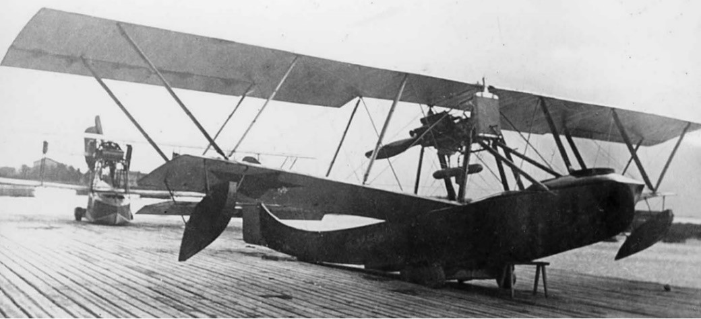

---

Tellier TELLIER 350 ch Sunbeam Tellier T.4 Патрульная летающая лодка 1918 заказ 315 изготовлено 35 лодок

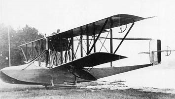

---

Nieuport VI Легкий многоцелевой самолет 1911 гидроплан Nieuport VI H более 20 самолетов

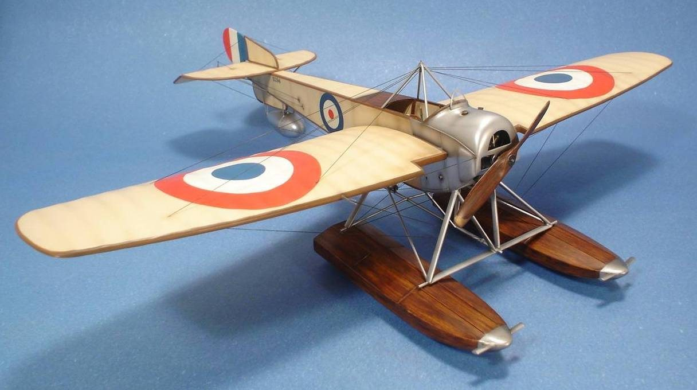
