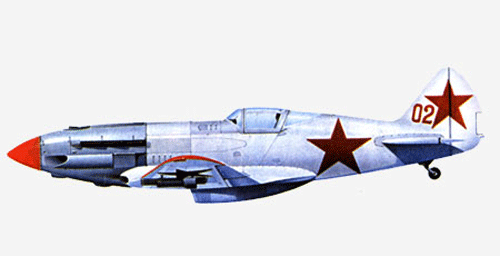

МиГ-3 представлял собой свободнонесущий низкоплан смешанной конструкции. Передняя часть фюзеляжа имела ферменную раму из стальных труб с дюралевой обшивкой. Задняя часть фюеляжа была деревянной. Крыло состояло из трёх частей: металлического центроплана, неразъёмно соединённого с фюзеляжем, и двух деревянных однолонжеронных консолей.

Профиль крыла "Кларк YH". Механизация крыла состояла из двухсекционных элеронов типа "Фрайз". На самолётах поздних серий устанавливались автоматические предкрылки. Шасси убирающееся трёхопорное с хвостовым колесом. Силовая установка состояла из поршневого V-образного двигателя жидкостного охлаждения АМ-35А (на части самолётов АМ-38) с трёхлопастным винтом изменяемого шага ВИШ-61Ш (на МиГ-1 - ВИШ-22Е).

Запуск двигателя осуществлялся сжатым воздухом. Фонарь кабины пилота не имел бронестекла. Его крышка сдвигалась назад на роликах. Впервые на отечественном серийном истребителе было установлено кислородное оборудование. Вооружение состояло из 12,7-мм пулемёта БС и 2 7,62-мм пулемётов ШКАС, установленных в передней части фюзеляжа над двигателем. Под крылом могли устанавливаться 6 направляющих для реактивных снарядов РС-82, подвешиваться 2 бомбы по 50-100 кг или устанавливаться 2 дополнительных 12,7-мм пулемёта БК.

