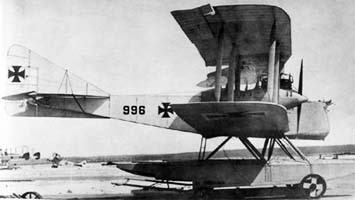
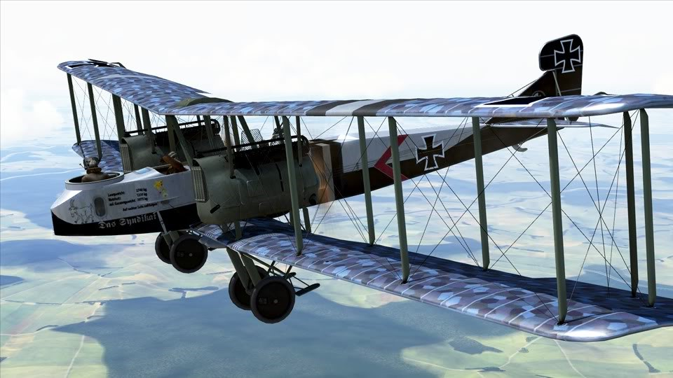
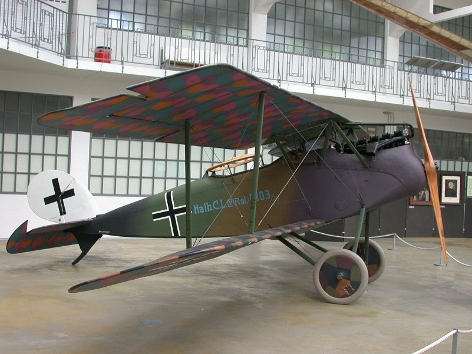
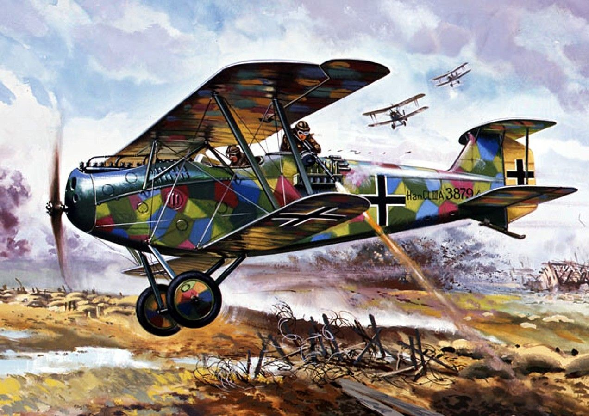
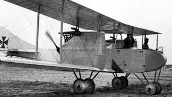

бомбардировщики германии

 A.E.G. G.II Тактический бомбардировщик  1916   Построено от    15 до 20 экземпляров 

A.E.G. G.III Тактический бомбардировщик  1916    120 экземпляров

A.E.G. G.IV Тактический бомбардировщик  1916  Всего было построено 542 самолета серии "G", \
из них - примерно 400 G.IV. 

AEG J.I / J.II    1918  Cамолет поддержки войск Всего было произведено более 607 самолетов JI и JII. 

Albatros G.II(III) Средний бомбардировщик   1916    Точное количество построенных самолетов G.III не установлено

Albatros J.I 1917/ J.II  1918 Самолет поддержки войск   J.I около 210 от 90 до 125 самолетов J.II. 

Albatros W.V    1916 г.Бомбардировщик-торпедоносец

DFW R.I Тяжелый бомбардировщик  1916 Единственный прототип

DFW R.II(III) Тяжелый бомбардировщик  1917  2 экземп.

Friedrichshafen FF.35 Бомбардировщик-торпедоносец    1916  два экземпляра  

Friedrichshafen FF 41     Бомбардировщик-торпедоносец   1917  FF 41а     9  самолетов  FF 41AT 8 экземпляров 

Friedrichshafen G.II Средний бомбардировщик   1915   35 экземпляров  

Friedrichshafen G.III\ G.IIIa Средний бомбардировщик   1917  245 экземпляров обоих типов.

Friedrichshafen G.IV Средний бомбардировщик  1917  138-245 экземпляров

Gotha G.I Cредний бомбардировщик   1915 17 самолетов

Gotha G.II Cредний бомбардировщик   1916 11 экз.

Gotha G.III Cредний бомбардировщик  1916 25 самолетов 

Gotha G.IV Cредний бомбардировщик  1916    230  экз.

Gotha G.V Дальний бомбардировщик   1917 205 экз.

 Gotha WD.11    1916 	Бомбардировщик-торпедоносец  12 таких самолетов

Gotha WD.14 1917  	Бомбардировщик-торпедоносец  Общее производство насчитывало 69 машин

Gotha G.IX   1918 	Средний бомбардировщик     90 экземпляров

Gotha GL.VII (G.VII)-Средний- бомбардировщик  1918  . 250 таких самолетов

Hansa Brandenburg G.I Средний бомбардировщик  1915      39      самолетов 

Hansa-Brandenburg GW Морской бомбардировщик-торпедоносец  1916   двадцать самолетов

Halberstadt CL.II Истребитель сопровождения и ударный самолет   1917   780 самолетов.

Halberstadt CL.IV Истребитель сопровождения и ударный самолет  1918   136 самолетов

Hannover CL.II Истребитель сопровождения и ударный самолет  1917   433  самолетов

Hannover CL.III - CL IIIa Истребитель сопровождения и ударный самолет 1917
CL III-80 самолетов
CL IIIa 611 самолетов

Hannover CL.V Истребитель сопровождения и ударный самолет  1918  46 самолетов  

Junkers J.I. 1917   Ударный самолет 189 экземпляров

Junkers   (J 10) CL.I  1918 	 Ударный самолет     54 самолетов

Rumpler G.I Тяжелый бомбардировщик  1915  (фирменное обозначение 5A 15), построено порядка 60 таких аппаратов 

Rumpler G.II Тяжелый бомбардировщик 1916 72 аппарата

Rumpler G.III Тяжелый бомбардировщик  1916 Из 90 произведенных машин 20 применялись в качестве ночных бомбардировщиков

Sablatnig N.I Ночной бомбардировщик   1918 пятнадцать самолетов

Siemens-Schukert R.IV Тяжелый бомбардировщик 1915  

Siemens-Schukert R.V Тяжелый бомбардировщик   1916   Единственный

Siemens-Schukert R.VI Тяжелый бомбардировщик  1916  Единственный В сентябре 1916-го R-IV начал совершать с аэродрома Вильно (Вильнюс) дневные и ночные налеты на позиции русских войск и тыловые объекты. До конца года к нему прибавились еще два аппарата - R-V и R-VI. Самолеты объединили в 501-ю эскадру тяжелых бомбардировщиков.

Zeppelin-Staaken R.VI Тяжелый бомбардировщик   1916  18 экземпляров

Zeppelin-Staaken R.XIV Тяжелый бомбардировщик  4  экземпляра

Zeppelin-Staaken R.XV Тяжелый бомбардировщик 1918  3 аппарата

Zeppelin-Staaken R.XVI Тяжелый бомбардировщик   1918   Были построены три R. XVI (Av) s;

Zeppelin-Staaken VGO.III Тяжелый бомбардировщик  1916  Один построен.
