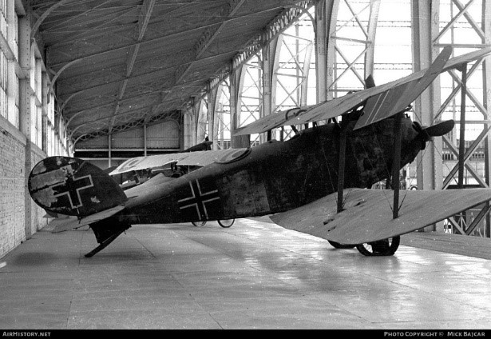
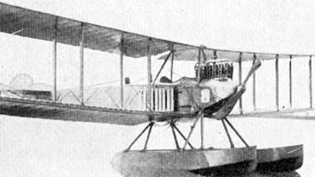

AEG C.IV Фронтовой разведчик  1916      687экземпляров.

AGO C.I  Вспомогательный самолет     50  машины

AGO C.IV Самолет-разведчик   1916  70 экземпляров 

AGO W.II  Вспомогательный гидросамолет  1913  10 экземпляров

Albatros B.I, II(III)  Самолет-разведчик   1914  2000 машин различных модификаций. 

Альбатрос Таубе  : 1911  	 Многоцелевой вспомогательный самолет  40 экземпляров
Всего за период 1910—1915 было построено около пятисот Taube  различных производителей

Albatros С.I Самолет-разведчик  1915

Albatros С.III  L.10 Самолет-разведчик   1915

Albatros С.V Самолет-разведчик   1916  400   экземпляров 

Albatros С.VII Самолет-разведчик  1916  400 -600 экземпляров

Albatros С.X Самолет-разведчик  1917 не менее 300 экземпляров

Albatros С.XII Самолет-разведчик  1917   200 экземпляров

Albatros DE Вспомогательный самолет 1913  40 экземпляров

Albatros W.I Разведывательный гидросамолет    1914  от 4 до 15 самолетов

Aviatik B.I   ( P.15A) Самолет-разведчик 1914  410   самолетов

Aviatik B.II(P.15B) Самолет-разведчик

Aviatik C.I Самолет-разведчик  1915    54   самолетов

Aviatik C.II Самолет-разведчик    43 самолета

Aviatik C.III Самолет-разведчик  1916  около 80 самолетов

DFW B.I(II) Разведывательный самолет 1914    130 самолетов

DFW C.I(II) Фронтовой разведчик   1916 130 самолетов

DFW C.IV Фронтовой разведчик  1916 70 самолетов

DFW C.V Фронтовой разведчик    1916 3 955 самолетов

DFW MARS Вспомогательный самолет  1912 более 80 самолетов

Euler B.I Разведывательный самолет  1914    B.I и B.II 90 самолетов   B.III -60  самолетов

Euler B.I (C.I) Разведывательный самолет  1914    30 самолетов

Euler MILITAR-DOPPELDECKER 1911 Вспомогательный самолет   14 самолетов

Fokker A.I  M.8 Разведывательный самолет 1914   63-85  самолетов

Fokker A.II   Разведывательный самолет 1913   20 самолетов 

Fokker B.I  м.7   Разведывательный самолет  1915   25 самолетов

Fokker B.II Учебно-тренировочный самолет  1915  22 самолета

Fokker B.III Учебно-тренировочный самолет   1916   18 экземпляров

Friedrichshafen FF 19 Разведывательный гидросамолет  1914  16 самолетов.

Friedrichshafen FF 29 \ FF 29A,Многоцелевой гидросамолет  1914  более 30 машин.

Friedrichshafen FF 33 Многоцелевой гидросамолет   1914   130 самолетов.

Friedrichshafen FF 39 Многоцелевой гидросамолет  1914    235 машин.

Friedrichshafen FF 49 Многоцелевой гидросамолет   FF 49с 270 машин  FF 49b  25   машин.

Gotha LD.5 Многоцелевой вспомогательный самолет  1914

Gotha LD.6  LD.7 Многоцелевой вспомогательный самолет  1915 в нескольких экземплярах

Gotha WD.1 Разведывательный гидросамолет   1914. 12 машин

Gotha WD.2 Разведывательный гидросамолет  1914  27 машин

Gotha WD.7 Многоцелевой вспомогательный гидросамолет 1914  8 экз.   

Halberstadt C.V Разведывательный самолет   1918   около 550  машин

Hansa-Brandenburg С.I Самолет-разведчик 1916     1318   машин

Hansa-Brandenburg GNW Разведывательный гидросамолет   1915   16 машин  

Hansa-Brandenburg NW Разведывательный гидросамолет   1915  Тридцать два самолета

Hansa-Brandenburg W Разведывательный гидросамолет  1914 27 самолетов

Lübeck-Travemünde F.2 Разведывательный гидросамолет  1914 16 самолетов

Lübeck-Travemünde F.4 Разведывательный гидросамолет 1917 34 самолетов

LVG С.I(II) Разведчик-бомбардировщик  1915   300 самолетов C.I и C.II.

LVG C.V  "Эльфауге" Фронтовой разведчик 1917 600 самолетов

LVG С.VI Разведчик-бомбардировщик  1918 1000 самолетов

Pfalz A.I Разведывательный самолет  1913   60 самолетов

Rumpler B.I  Разведывательный самолет 1914    198 самолетов

Rumpler C.I Многоцелевой самолет  1915 более 1000 C.I и C-Ia

Rumpler C.III Многоцелевой самолет 1916    75 самолетов

Rumpler C.IV Разведывательный самолет   1916   менее 100  самолетов

Rumpler C.VII Разведывательный самолет  1917         400 самолетов

Rumpler C.VIII Учебно-тренировочный самолет  1917  50 самолетов

Rumpler C.IX(X) Разведывательный самолет  1917   20 самолетов

Sablating SF.2 Разведывательный гидросамолет  1916 26 самолетов

Sablating SF.5 Разведывательный гидросамолет  1917  101   самолет

Zeppelin C.I(II) Cамолет-разведчик  1917
C.I. 2 машины
C.II 20 машин
