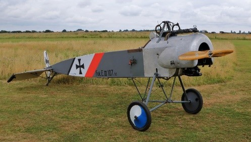
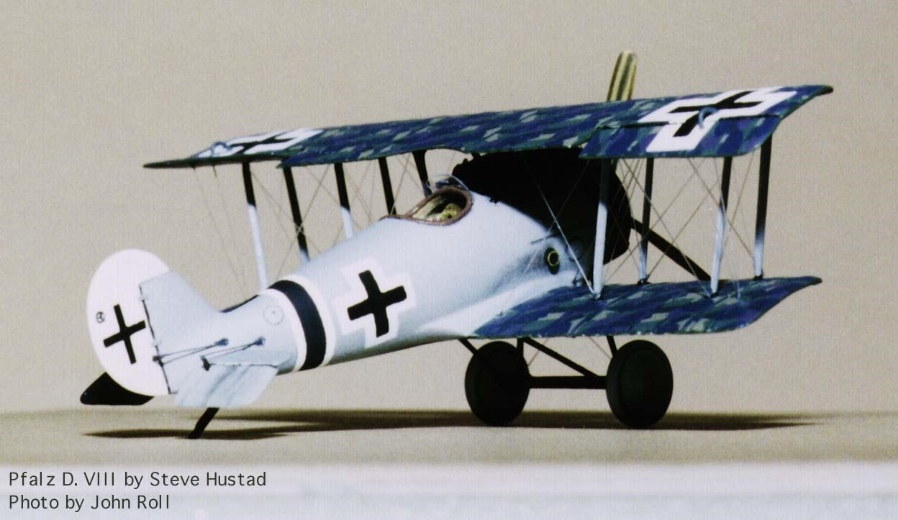
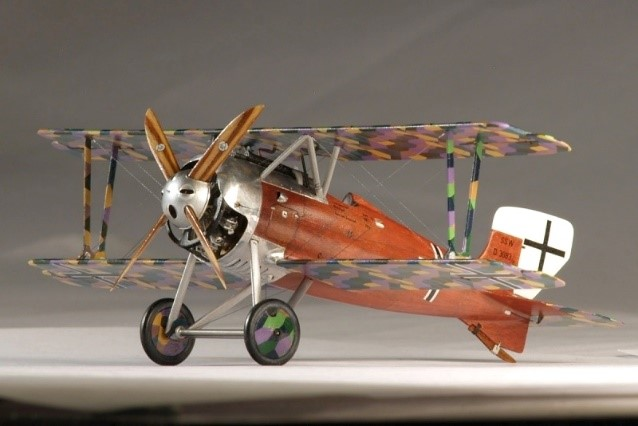

 .AEG D.I  1917 	Истребитель 3 самолета
 

AEG DJ.I   1918  Ударный 	   Истребитель   3 самолета

Albatros D.I Истребитель   1916 75 самолетов

Albatros D.II Истребитель   1916   214 самолетов

Albatros D.III   1917 Истребитель-разведчик 1340 экземпляров 

Albatros D.V 1917  Истребитель 900 самолетов D.V и 1662 D.Va

Albatros W.IV Поплавковый истребитель  1916   118 самолетов

Daimler D.I Истребитель  1918 6 самолетов.

Euler D.II Истребитель  1917  30   самолетов

Fokker D.I   Истребитель  1916   112 самолета   

Fokker D.II      Истребитель-разведчик 1916  181 самолет

Fokker D.III    Истребитель-разведчик 1916   210  самолетов

Fokker D.IV Истребитель  1916    60 самолетов

Fokker D.V     Истребитель-разведчик и тренировочный истребитель 1916  216 самолетов

Fokker D.VI Истребитель  1917    59 самолетов  

Fokker D.VII Скоростной истребитель 1918  3300 самолетов  

Fokker D.VIII Истребитель-разведчик   1918 381 самолет

Fokker Dr.I Истребитель   1917 320 самолетов

Fokker E.I Истребитель-разведчик  1915   416 самолетов

Fokker E.II Истребитель   1915 59 самолетов

Fokker E.III Истребитель   1916 270 самолетов.

Fokker E.IV Истребитель  1916  49 самолетов

Friedrichshafen FF.48 Истребитель     1917 3  самолета

Halberstadt CL.II Истребитель сопровождения и штурмовик    1917   780 самолетов

Halberstadt CL.IV Истребитель сопровождения и штурмовик      1918  136 самолетов

Halberstadt D.II Истребитель       1915  96 самолетов

Halberstadt D.III Истребитель    1915  54 самолетов

Halberstadt D.V Истребитель   1916   57 самолетов

Hansa-Brandenburg D.I Истребитель  1916 123 самолета

Hansa-Brandenburg KDW Морской истребитель-разведчик   1916
58 самолетов

Hansa-Brandenburg W.12   1917
Морской истребитель-разведчик   
•	W. 12: модель немецкого военно-морского флота. 146 построено.
•	W-A: голландская лицензия-построенный W. 12, с двигателем Benz. 35 построено.

Hansa-Brandenburg W.19  1917   Морской истребитель-разведчик  55 самолетов

Hansa-Brandenburg W.29   1918  Истребитель-гидросамолет
78 самолетов

Hansa-Brandenburg W.33    1918  Морской истребитель   26 самолетов

Junkers D.I  1918   Истребитель 41 самолет 

Kondor E.III    1918 Истребитель 10 самолетов

LFG Roland D.I  1916  Истребитель  "Хайфиш" (акула)
60 самолетов

LFG Roland D.II   1916   Истребитель     70 самолетов D.II и 300 D.IIa

LFG Roland D.III    1917  Истребитель  100 самолетов

LFG Roland D.VI    1918  Истребитель   150 D.VIa и 200 D.VIb самолетов

Pfalz Dr.I   1917  Истребитель      10 самолетов

Pfalz D.III   1917 Истребитель   260 D.III and 750 D.IIIa

Pfalz D.VIII   1918  Истребитель   40 самолетов

Pfalz D.ХII   1918  Истребитель     750 самолетов, 

Pfalz E.I    1915 Истребитель  74 самолетов

Pfalz E.II Истребитель   1915     80 самолетов

Pfalz E.III Истребитель  1916  20  самолетов

Pfalz E.IV Истребитель  1916  24 самолета

Pfalz E.V Истребитель  1916  20   самолетов   

Rumpler 6B Поплавковый истребитель  1916      88 самолетов 

Rumpler D.I  Истребитель  1917 22 самолета 

 Siemens-Schuckert D.I Истребитель 1916   95 самолетов 

Siemens-Schuckert D.III Истребитель  1917 134 самолета

Siemens-Schuckert D.IV Истребитель 1918       178 самолетов

Zeppelin D.I Истребитель  1918  7 самолетов

