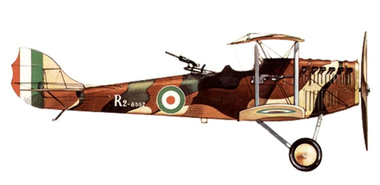

# Cамолеты италии

Ansaldo - A.1 Ballila - 1917 -  Истребитель Всего построено 200 экземпляров.

Ansaldo - ISVA,    - 1918 -  . ISVA являлся гидроистребителем, созданным на базе SVA-2  построили порядка 50 машин

Ansaldo SVA.1(2) Разведчик-истребитель  1917   65 таких машин 

АНСАЛЬДО S.V.A.5     1917г разведчик и легкий бомбардировщик  1245 экземпляров

Ansaldo - SVA.9 ,10-1918 -Фронтовой самолет    более 50 экземпляров

Caproni - Ca.1 - Ca.3  - 1914 – Бомбардировщик.Сaproni Cа.1  162 машины   Ca. 3     269 аэропланов 

Caproni - Ca.4 (Ca.40 - Ca.43) - 1916  Бомбардировщик   40 экземпляров 

Caproni - Ca.5 (Ca.44 - Ca.47) - 1917 -  Бомбардировщик   255 экземпляров

FIAT - R2 - 1918 – разведчик 129 машин

Macchi NIEUPORT 11000 N.11 Bebe  Истребитель 1915г.

Macchi - M.5- M.6 - 1917 летающая лодка истребитель 240 экземпляров

MACCHI M.14    1918 Учебный Истребитель   10 экземпляров

Pomilio – PC-PD-PE - 1916 - Фронтовой самолет 545 экземпляров самолетов PC и PD (большинство - самолеты PD),

 Pomilio – PE  1917  Разведывательный самолет    1071 экземпляр

 

SAML - S.1/S.2 - 1917 - Разведчик/легкий бомбардировщик

SIA - 7B / 7b2 /  - 1917 - Фронтовой самолет  501 экземпляр - SIA.7B,71- экземпляр SIA-7B2 

SIA 9B Легкий бомбардировщик 1917    62 экземпляра

SIAI - S.8 / S.9 – 1917  Разведчик и противолодочная летающая лодка 172 экземпляра

Savoia-Pomilio SP.2 1916  Разведчик-бомбардировщик 300 экземпляров

Savoia-Pomilio - SP.3- 1917 Разведчик-бомбардировщик 300  экземпляров

Savoia-Pomilio - SP.4 – 1917
Разведчик-бомбардировщик
146     экземпляров