Предлагаю подборку самолетов Первой мировой  войны выпускавшихся серийно.Подобраны по странам.Начнем с самолетов Российской империи.  

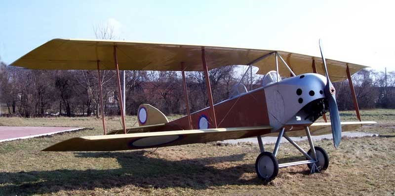

**Анатра Анаде** ( Анатра-Декан) 1915 г.  Самолёт-разведчик **215** экземпляров,

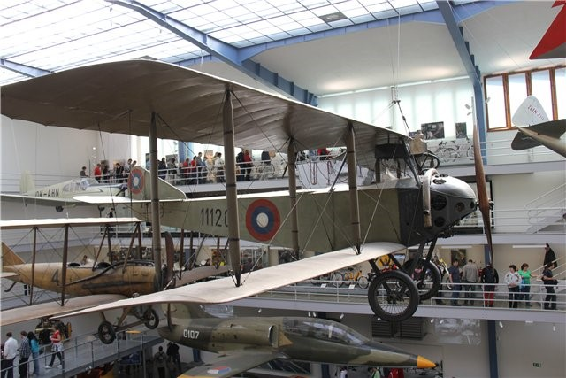

**Анатра Анаклер** (Анасаль) Самолет-разведчик    1915 г. 24 экземпляра

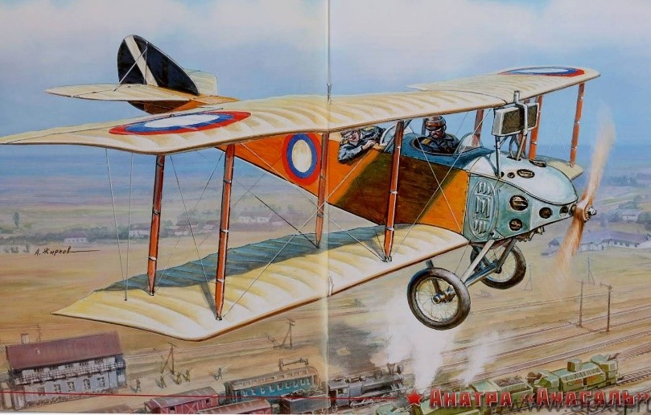

**Анатра Анатра-ДС** (Анасаль) Самолет-разведчик    1916 г. более 100 экземпляров

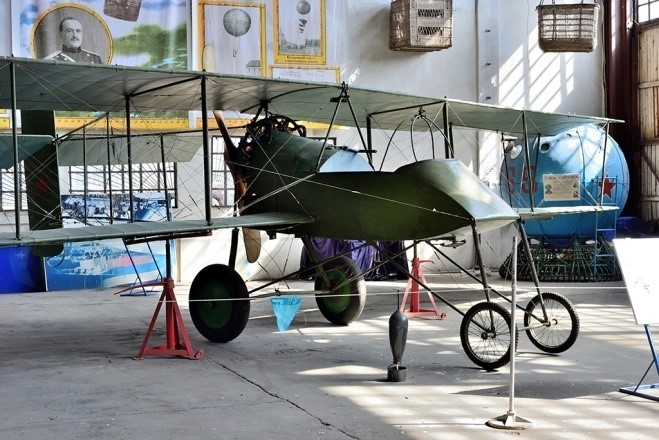

Анатра Вуазен Иванова  1916 г Самолёт-разведчик  150 экземпляров 

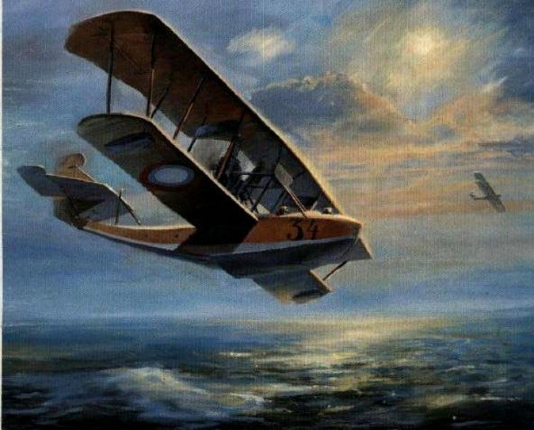

Григорович М-5 - М-8    1915 г. Летающая лодка   71 такой гидроплан

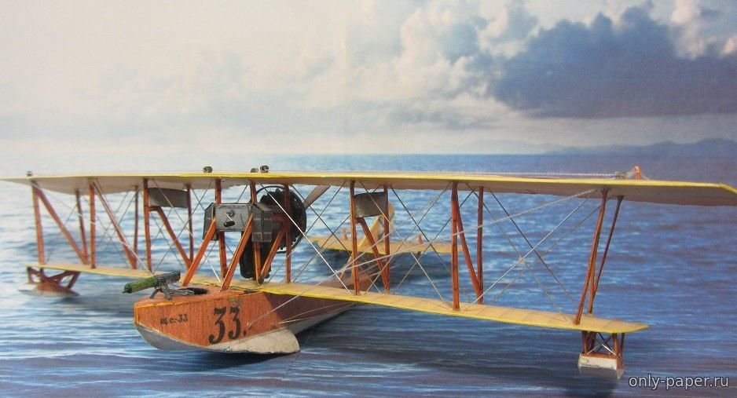

Григорович М-9/М-19 Летающая лодка  1916 г.  212 экземпляров М-9.

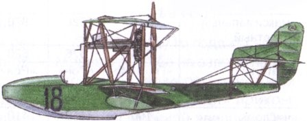

Григорович М-11/ М-12\ М-17
1916 г.Летающая лодка-истребитель
61 экземпляр М-11 и М-12 из 100 заказанных

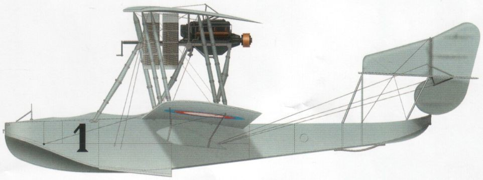

Григорович М-15/М-18/М-19
1916 г. Летающая лодка-истребитель     54 экземпляра

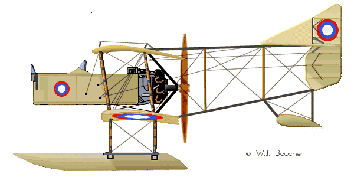

Григорович М-16    1916г.Гидросамолёт-разведчик
36 - 40 экземпляров

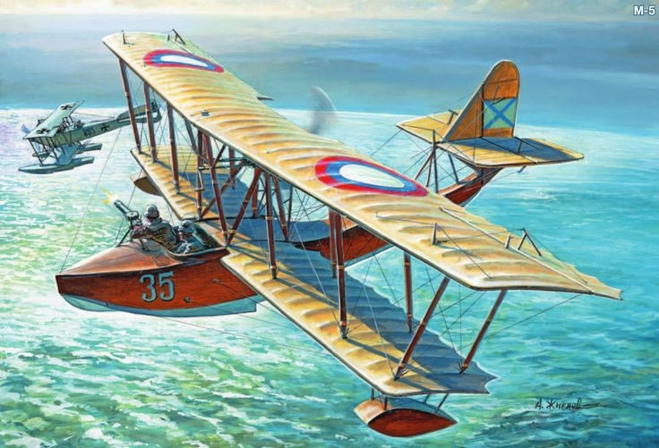

Григорович М-20  1917 г.  Учебная летающая лодка около 80 экземпляров. прежние М-5 с небольшими изменениями конструкции.

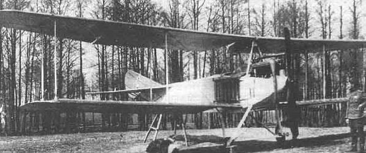

Лебедев Лебедь-XI 1915 г  Морской
Самолет-разведчик 15 машин

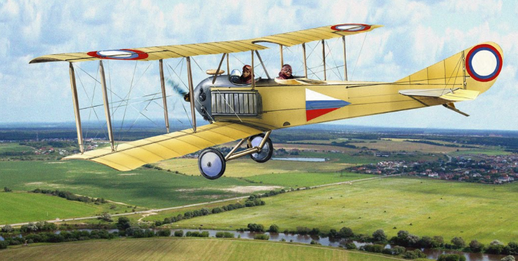

Лебедев Лебедь-XII    1916 Фронтовой самолет 216 аппаратов

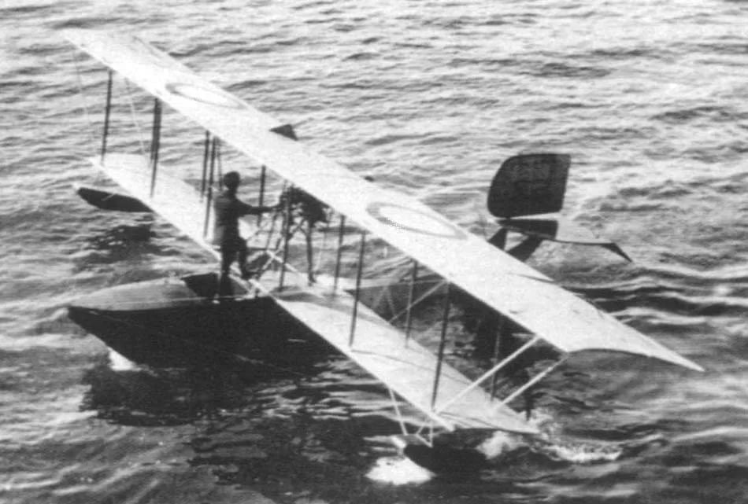

Лебедев ЛМ-2 / Лебедь Морской №2    1914 г. Разведывательная летающая лодка ЛМ-2 

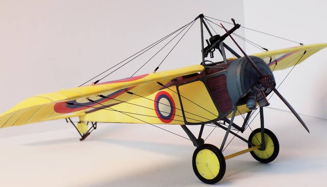

Моска, Быстрицкий МБ / МБ бис   1915 г.  Самолет-разведчик  заказ
(125 экз.). сдали 25

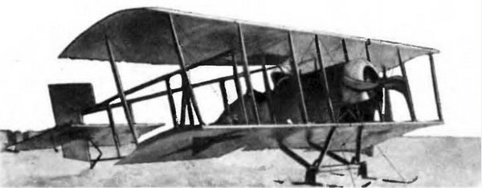

Пороховщиков А.А. П-IV / П-VI  1917 г. Учебно-тренировочный самолет. Серия из 40 машин. 

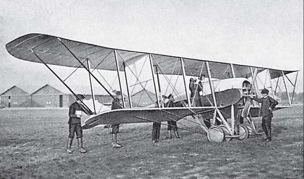

Сикорский С-10  1913 г.    Самолёт-разведчик Всего было построено 16 машин

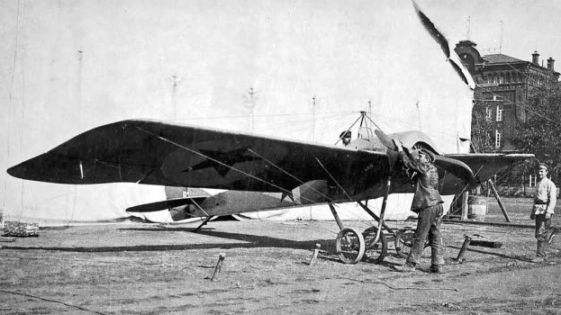

Сикорский С-12   1914 г.     Учебно-тренировочный самолётСикорский 9 самолетов

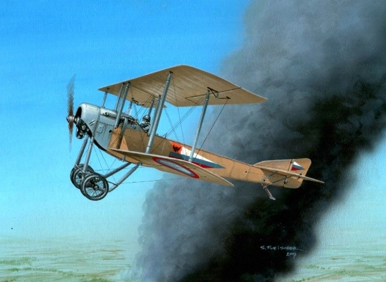
Сикорский С-16 / С-XVI    1915 г  
18 экземпляров 15 экземпляров С-16з

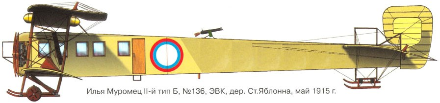

Сикорский Илья Муромец серии Б 1915   6 экземпляров "ИМ" тип Б

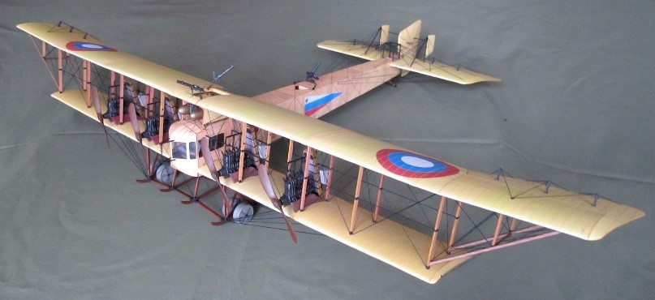

Сикорский Илья Муромец серии В (выпущено 30 единиц)

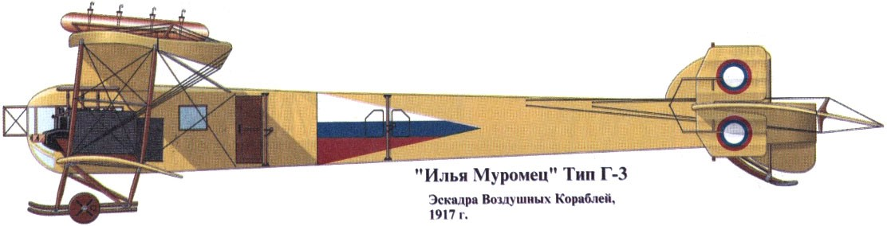

Сикорский Илья Муромец серии Г   1915 г., поступило 32 таких аппарата